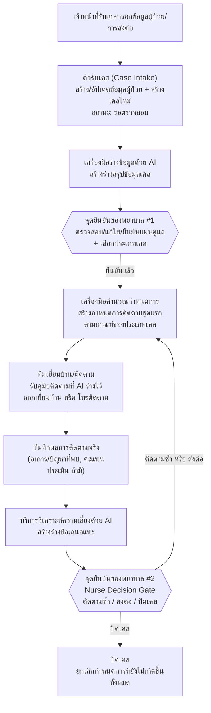
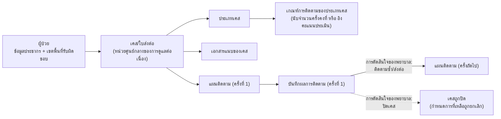

# สถาปัตยกรรมระบบ — Chira Continuity Care (Triple C)

เอกสารนี้อธิบายสถาปัตยกรรมของระบบ Chira Continuity Care (Triple C) ในระดับแนวคิด (conceptual /
high-level) โดยตั้งใจให้ยังคงถูกต้องแม้เทคโนโลยีที่อยู่เบื้องหลังการ implement จะเปลี่ยนไปในอนาคต — จึงเลือก
เรียกทุกส่วนประกอบด้วย **ความรับผิดชอบ (responsibility)** ของมัน ไม่ใช่ชื่อภาษา/เฟรมเวิร์ก/ผลิตภัณฑ์ที่ใช้
implement อยู่ในปัจจุบัน หากมีการอ้างอิงถึงตัวเลือกทางเทคนิคที่ใช้อยู่จริงในปัจจุบัน จะระบุไว้ในกรอบ
"*หมายเหตุการ implement ปัจจุบัน*" แยกออกจากเนื้อหาหลักเสมอ

---

## 1. วัตถุประสงค์และขอบเขต

### 1.1 วัตถุประสงค์

Chira Continuity Care (Triple C) เป็นระบบติดตามการดูแลต่อเนื่อง (continuity of care) สำหรับทีมเยี่ยมบ้าน/
ติดตามผู้ป่วยของโรงพยาบาล สร้างขึ้นเพื่อทดแทนช่องว่างที่เกิดจากการยกเลิกระบบ "Thai COC" ระดับประเทศ
เป้าหมายหลักคือทำให้ข้อมูลผู้ป่วยไหลต่อเนื่องตั้งแต่จุดที่ถูกส่งต่อเข้ามา (หอผู้ป่วย/OPD/หน่วยงานภายใน/
โรงพยาบาลอื่น) ไปจนถึงการติดตามที่บ้านและการปิดเคสอย่างมีร่องรอยตรวจสอบได้ (auditable) โดยใช้ผู้ช่วย AI
เพื่อร่างข้อมูล/ข้อเสนอแนะให้เจ้าหน้าที่ทำงานได้เร็วขึ้น แต่**มนุษย์ (พยาบาล/เจ้าหน้าที่) เป็นผู้ตัดสินใจเสมอ
100%** — นี่คือหลักการที่ครอบงำการออกแบบทุกส่วนของระบบ (ดูหัวข้อ 6)

ระบบครอบคลุมวงจรการทำงานเต็มรูปแบบ (end-to-end loop):

```
รับเคส → AI สรุปข้อมูล (ร่าง) → พยาบาลตรวจสอบ/ยืนยันแผนดูแล → สร้างกำหนดการติดตามอัตโนมัติ →
เยี่ยมบ้าน/โทรติดตาม (พร้อมคู่มือจาก AI) → บันทึกผล → AI วิเคราะห์ความเสี่ยง (ร่าง) →
พยาบาลยืนยันการตัดสินใจเสมอ 100% (ติดตามซ้ำ/ส่งต่อ/ปิดเคส) → สร้างกำหนดการถัดไปอัตโนมัติ หรือปิดเคส
```

### 1.2 ขอบเขตของเอกสารฉบับนี้

เอกสารฉบับแรกนี้เจาะลึกเฉพาะ **วงจรหลักของงาน (core loop) และการไหลของข้อมูลตาม user journey** เป็นหลัก
ส่วน "Actor/บทบาท" และ "ข้อพิจารณาที่ไม่ใช่ functional" นำเสนอในระดับแนวคิดสั้น ๆ เท่านั้น (ไม่ลงรายละเอียด
ระดับ CRUD ของหน้าจอแอดมิน หรือ permission matrix แบบเจาะทุกช่อง)

### 1.3 นอกขอบเขตของระบบ (Explicit Out-of-Scope)

- **การวินิจฉัย/ตัดสินใจทางคลินิกแทนมนุษย์** — ระบบไม่ทำหน้าที่วินิจฉัยหรือสั่งการรักษา ผลจาก AI เป็นได้แค่
  ข้อมูลร่าง/ข้อเสนอแนะเพื่อประกอบการตัดสินใจของบุคลากรทางการแพทย์เท่านั้น
- **การประเมินคุณภาพเชิงเนื้อหาของผลลัพธ์ AI** — ระบบรับผิดชอบแค่การจัดการ/แสดงผล/fallback ของผลลัพธ์ AI
  อย่างถูกต้อง ไม่รับผิดชอบความถูกต้องทางคลินิกของสิ่งที่โมเดลภาษาสร้างขึ้น
- **การเป็นระบบเวชระเบียนอิเล็กทรอนิกส์ (EMR) แบบเต็มรูปแบบ** — ระบบเก็บเฉพาะข้อมูลที่จำเป็นต่อการติดตาม
  ต่อเนื่องหลังส่งต่อ ไม่ใช่บันทึกการรักษาทั้งหมดของโรงพยาบาล
- **การเชื่อมต่อโดยตรงกับระบบภายนอกโรงพยาบาลอื่นหรือหน่วยงานรัฐ** (เช่น การแทนที่ Thai COC แบบเชื่อมต่อ
  ข้ามหน่วยงานอัตโนมัติ) — ปัจจุบันข้อมูลจากภายนอกเข้าสู่ระบบผ่านการกรอกโดยเจ้าหน้าที่ ไม่ใช่ผ่าน
  interface เชื่อมต่อระบบอัตโนมัติ
- **การจัดการสิทธิ์ผู้ใช้แบบละเอียด (fine-grained permission) เกินกว่า 3 บทบาทหลัก** — มีบทบาทเชิงแนวคิด
  เพียงไม่กี่ระดับ (ดูหัวข้อ 2) ไม่ใช่ระบบสิทธิ์แบบปรับแต่งได้ตามหน่วยงานย่อย

---

## 2. Actor และบทบาทเชิงแนวคิด

ระบบมีบทบาทเชิงแนวคิดหลัก 3 กลุ่ม ทุกบทบาทต้องผ่านการยืนยันตัวตน (authentication) ก่อนเข้าถึงข้อมูลผู้ป่วย
ใด ๆ เสมอ

| บทบาท | ความรับผิดชอบเชิงแนวคิด |
|---|---|
| **เจ้าหน้าที่รับเคส/หอผู้ป่วย (Ward/Intake Staff)** | รับข้อมูลผู้ป่วยที่ถูกส่งต่อเข้ามา (จากหอผู้ป่วย/OPD/หน่วยงานภายใน/โรงพยาบาลอื่น) และกรอกเข้าสู่ระบบเป็นเคสใหม่ พร้อมแนบเอกสารประกอบ |
| **ทีมเยี่ยมบ้าน/ติดตามผู้ป่วย (Home-Visit / Follow-up Team)** | ตรวจสอบและยืนยันร่างสรุปข้อมูล/แผนดูแลที่ AI ช่วยร่างไว้ ออกเยี่ยมบ้านหรือโทรติดตามตามกำหนดการ บันทึกผลการติดตาม และเป็นผู้**ยืนยันการตัดสินใจ**ในทุกจุดที่ AI เสนอแนะ (บทบาทนี้ในทางปฏิบัติมักดำเนินการโดยพยาบาล จึงเป็นผู้ถือ "จุดยืนยัน" หลักของระบบตามหัวข้อ 6) |
| **ผู้ดูแลระบบ (Administrative Role)** | รับผิดชอบการตั้งค่าเชิงโครงสร้างของระบบ — กำหนด/แก้ไขประเภทเคสและเกณฑ์การคำนวณกำหนดการติดตาม และจัดการบทบาทผู้ใช้งาน ไม่ได้เข้าไปยุ่งเกี่ยวกับข้อมูลทางคลินิกของแต่ละเคสโดยตรง |

หมายเหตุ: ในทางปฏิบัติ ผู้ใช้คนเดียวกันอาจสวมบทบาทได้มากกว่าหนึ่งบทบาทในบางจุดของ workflow (เช่น
เจ้าหน้าที่รับเคสและทีมเยี่ยมบ้านอาจเป็นคนละคนหรือคนเดียวกันก็ได้ ขึ้นกับการจัดการงานภายในหน่วยงาน) —
ระบบยึดตาม "ความรับผิดชอบต่อขั้นตอน" มากกว่ายึดตามตัวบุคคล

---

## 3. ขอบเขตระบบ (System Context)

### 3.1 สิ่งที่อยู่ภายในขอบเขตระบบ

ทุก capability ที่จัดการข้อมูลเคส/ผู้ป่วย/กำหนดการติดตาม/ผลการติดตาม รวมถึงตรรกะการร่างข้อมูลด้วย AI และ
ตรรกะการคำนวณกำหนดการ ถือเป็นส่วนหนึ่งของระบบ และทำงานอยู่**ภายในเครือข่ายของโรงพยาบาล**

### 3.2 สิ่งที่อยู่ภายนอกขอบเขตระบบ — และทำไม

| ภายนอกระบบ | บทบาท/เงื่อนไข |
|---|---|
| **บริการประมวลผลภาษาด้วย AI (AI Language Inference Service)** | เป็นบริการที่ระบบเรียกใช้เพื่อสร้างร่างข้อมูล/ข้อเสนอแนะ แต่**ต้องติดตั้งและเข้าถึงได้จากภายในเครือข่ายโรงพยาบาลเท่านั้น (self-hosted, intranet-only)** — ข้อมูลผู้ป่วย (PHI) ที่ถูกส่งไปประมวลผลต้อง**ห้ามออกนอกเครือข่ายเด็ดขาด** ไม่ว่าในสถานการณ์ใด นี่คือข้อจำกัดที่สำคัญที่สุดของขอบเขตระบบ *(หมายเหตุการ implement ปัจจุบัน: บริการนี้คือ Ollama ที่รันภายในเครื่องเซิร์ฟเวอร์ของ รพ. เอง เรียกผ่าน HTTP ภายในเครือข่ายเดียวกัน)* |
| **แหล่งที่มาของเคส (หอผู้ป่วย/OPD/หน่วยงานภายใน/โรงพยาบาลอื่น)** | เป็นต้นทางของข้อมูลผู้ป่วยที่จะถูกส่งต่อเข้าระบบ แต่**ไม่มีการเชื่อมต่อระบบอัตโนมัติ** — ข้อมูลเข้าสู่ระบบผ่านการกรอกโดยเจ้าหน้าที่รับเคสเสมอ (ดูหัวข้อ 1.3) |
| **ผู้ใช้งานปลายทาง (เจ้าหน้าที่/พยาบาล/ผู้ดูแลระบบ)** | เข้าถึงระบบผ่านอุปกรณ์ (คอมพิวเตอร์/มือถือ/แท็บเล็ต) ภายในหรือเชื่อมต่อเข้าเครือข่าย รพ. — อยู่นอกขอบเขตของ "ระบบ" ในเชิงสถาปัตยกรรม แต่เป็น actor หลักตามหัวข้อ 2 |

### 3.3 เหตุผลของขอบเขตนี้

จุดตัดสำคัญที่สุดของ system context คือเส้นแบ่งระหว่าง "ระบบหลัก" กับ "บริการ AI" — แม้บริการ AI จะถูกเรียก
ใช้บ่อยและเป็นส่วนสำคัญของประสบการณ์ผู้ใช้ แต่ถูกจัดให้อยู่**นอกขอบเขตความไว้วางใจแบบเต็ม (trust boundary)**
ของระบบหลักโดยเจตนา เพราะ (1) มันเป็นบริการที่อาจถูกเปลี่ยนโมเดล/ปรับแต่ง/แทนที่ได้ในอนาคตโดยไม่ควรกระทบ
ตรรกะทางธุรกิจ และ (2) ผลลัพธ์ที่ได้กลับมาไม่ควรถูกเชื่อถือว่าเป็น "ความจริง" ทันที (ดูหัวข้อ 6) —
ทุกอย่างที่ไหลออกจากบริการนี้ต้องผ่านจุดตรวจสอบของมนุษย์ก่อนเสมอ ไม่ว่าบริการ AI เบื้องหลังจะเปลี่ยนเป็น
อะไรก็ตาม ข้อจำกัดเรื่อง "ต้องอยู่ในเครือข่ายภายในเท่านั้น" ก็ยังคงต้องอยู่เสมอ เพราะเป็นข้อกำหนดด้านความ
ปลอดภัยของข้อมูลผู้ป่วย (PHI) ไม่ใช่ข้อจำกัดทางเทคนิคชั่วคราว

---

## 4. แผนที่ Capability เชิงแนวคิด

ระบบประกอบด้วย capability เชิงตรรกะ (logical building blocks) ดังนี้ แต่ละอันมีความรับผิดชอบที่แยกจากกัน
ชัดเจน:

```mermaid
flowchart TB
    subgraph รับเคสและยืนยันแผน
        CI[ตัวรับเคส<br/>Case Intake]
        ADE[เครื่องมือร่างข้อมูลด้วย AI<br/>AI Draft Engine]
        CPC[การยืนยันแผนดูแล<br/>Care-Plan Confirmation]
    end
    subgraph ติดตามและบันทึกผล
        SE[เครื่องมือคำนวณกำหนดการ<br/>Scheduling Engine]
        FGR[คู่มือติดตาม และการบันทึกผล<br/>Follow-up Guide & Outcome Recording]
    end
    subgraph วิเคราะห์และตัดสินใจ
        ARA[บริการวิเคราะห์ความเสี่ยงด้วย AI<br/>AI Risk Analysis]
        NDG[จุดยืนยันการตัดสินใจของพยาบาล<br/>Nurse Decision Gate]
    end
    ADMIN[การบริหารจัดการระบบ<br/>Administration]

    CI --> ADE --> CPC --> SE --> FGR --> ARA --> NDG
    NDG -.-> SE
    ADMIN -.กำหนดเกณฑ์ที่ SE ใช้.-> SE
```

- **ตัวรับเคส (Case Intake)** — รับข้อมูลผู้ป่วยและรายละเอียดการส่งต่อ สร้าง/อัปเดตข้อมูลผู้ป่วย ตรวจจับ
  เขตพื้นที่รับผิดชอบ (ในเขต/นอกเขต) และจัดเก็บเอกสารแนบอย่างปลอดภัย เป็นจุดเริ่มต้นของทุกเคส
- **เครื่องมือร่างข้อมูลด้วย AI (AI Draft Engine)** — สร้าง**ร่าง**เนื้อหาที่ช่วยให้มนุษย์ทำงานเร็วขึ้น
  ครอบคลุมทั้งร่างสรุปข้อมูลเคสตอนรับเข้า และร่างคู่มือหัวข้อที่ควรประเมินก่อนออกเยี่ยม/โทรติดตาม —
  ผลลัพธ์ทุกชิ้นเป็น **draft ที่แก้ไขได้และยังไม่ผูกกับการตัดสินใจใด ๆ**
- **การยืนยันแผนดูแล (Care-Plan Confirmation)** — จุดที่มนุษย์ตรวจสอบ แก้ไข และยืนยันร่างสรุปข้อมูลให้
  กลายเป็น "แผนดูแลที่ยืนยันแล้ว" พร้อมเลือกประเภทเคสที่จะใช้กำหนดเกณฑ์การติดตาม — เป็นจุดควบคุมสำคัญจุดแรก
  ของระบบ (ดูหัวข้อ 6)
- **เครื่องมือคำนวณกำหนดการ (Scheduling Engine)** — แปลงเกณฑ์การติดตามของประเภทเคส (ไม่ว่าจะเป็นแบบนับ
  จำนวนครั้งคงที่ หรือแบบอิงคะแนนประเมิน) ให้กลายเป็นกำหนดการเยี่ยมบ้าน/โทรติดตามจริง ทำงานทั้งตอนเริ่มเคส
  (หลังยืนยันแผนดูแล) และตอนสร้างกำหนดการครั้งถัดไป (หลังพยาบาลตัดสินใจ)
- **คู่มือติดตาม และการบันทึกผล (Follow-up Guide & Outcome Recording)** — นำเสนอคู่มือ (ร่างจาก AI Draft
  Engine) ให้ทีมเยี่ยมบ้านใช้ประกอบการเยี่ยม/โทร และเป็นจุดที่บันทึกผลลัพธ์จริงจากการติดตามครั้งนั้น
- **บริการวิเคราะห์ความเสี่ยงด้วย AI (AI Risk Analysis)** — อ่านผลการติดตามที่บันทึกไว้แล้วสร้าง**ร่าง**
  ข้อเสนอแนะ (เช่น ระดับความเสี่ยงที่ตรวจพบ และแนวทางที่อาจเหมาะสม) — เป็นข้อเสนอแนะเท่านั้น ไม่ใช่การ
  ตัดสินใจ
- **จุดยืนยันการตัดสินใจของพยาบาล (Nurse Decision Gate)** — บังคับให้มนุษย์เลือกและยืนยันการตัดสินใจจริง
  (ติดตามซ้ำ/ส่งต่อ/ปิดเคส) เสมอ 100% ก่อนที่ระบบจะดำเนินการต่อ ผลจากจุดนี้จะย้อนกลับไปกระตุ้น Scheduling
  Engine ให้สร้างกำหนดการถัดไป หรือสั่งปิดเคส
- **การบริหารจัดการระบบ (Administration)** — ความรับผิดชอบเชิงโครงสร้างที่ไม่ผูกกับเคสใดเคสหนึ่งโดยตรง
  ได้แก่การกำหนด/แก้ไขประเภทเคสและเกณฑ์การคำนวณกำหนดการที่ Scheduling Engine ใช้อ้างอิง และการจัดการ
  บทบาทผู้ใช้งาน (กล่าวถึงโดยย่อตามขอบเขตของเอกสารฉบับนี้ — ดูหัวข้อ 1.2)

---

## 5. Data flow ตาม User Journey

นี่คือส่วนสำคัญที่สุดของเอกสารฉบับนี้ — การเดินตามวงจรการทำงานทั้งหมดทีละขั้นตอน พร้อมระบุว่าข้อมูลใดถูก
สร้าง/อ่าน/อัปเดตที่จุดใด, capability/บทบาทใดเป็นผู้แตะต้องข้อมูลนั้น, และจุดยืนยันของมนุษย์อยู่ตรงไหนบ้าง

### 5.1 ภาพรวม (diagram)



### 5.2 รายละเอียดตามขั้นตอน

**ขั้นที่ 1 — รับเคส (Intake)**
เจ้าหน้าที่รับเคสกรอกข้อมูลผู้ป่วย (รวมถึงหมายเลขประจำตัวผู้ป่วยที่ใช้อ้างอิงซ้ำได้, ที่อยู่/ตำบล) และ
รายละเอียดการส่งต่อ (แหล่งที่มา, ข้อความสรุปอาการ/สถานการณ์เบื้องต้น) พร้อมแนบเอกสารประกอบได้ถ้ามี —
*ข้อมูลที่ถูกสร้าง:* ระเบียนผู้ป่วย (ใหม่ หรืออัปเดตระเบียนเดิมถ้าพบหมายเลขผู้ป่วยซ้ำ) และระเบียนเคส/
ใบส่งต่อใหม่ที่มีสถานะ "รอตรวจสอบ" — *ข้อมูลที่ถูกอ่าน:* รายชื่อตำบลในเขตรับผิดชอบ เพื่อใช้ตรวจจับเขต
พื้นที่ (ในเขต/นอกเขต) ให้อัตโนมัติ โดยเจ้าหน้าที่ยังสามารถปรับแก้เขตเองได้เสมอหากตรวจจับไม่ได้หรือไม่ถูกต้อง
— *ผู้แตะต้อง:* เจ้าหน้าที่รับเคส ผ่าน capability "ตัวรับเคส" — ยังไม่มี AI เข้ามาเกี่ยวข้องในขั้นนี้

**ขั้นที่ 2 — AI สรุปข้อมูล (draft)**
เมื่อเคสถูกสร้างแล้ว เจ้าหน้าที่ (มักเป็นทีมเยี่ยมบ้าน/พยาบาล) สามารถขอให้ AI Draft Engine อ่านข้อมูลดิบของ
เคสแล้วสร้าง**ร่าง**สรุปข้อมูล — *ข้อมูลที่ถูกอ่าน:* ข้อมูลผู้ป่วย + ข้อความสรุปอาการ/สถานการณ์ที่กรอกไว้ตอน
รับเคส — *ข้อมูลที่ถูกสร้าง:* ร่างสรุปข้อมูลเคส (เก็บแยกจากข้อมูลที่ "ยืนยันแล้ว" อย่างเด็ดขาด) — ขั้นนี้
ขอซ้ำได้ไม่จำกัดจำนวนครั้งตราบใดที่ยังไม่ผ่านการยืนยัน และร่างใหม่จะแทนที่ร่างเก่าเสมอ — หากบริการ AI
เรียกไม่สำเร็จ (เชื่อมต่อไม่ได้ หรือประมวลผลไม่สำเร็จ) ระบบต้องแจ้งเตือนและ**ไม่แก้ไขข้อมูลเคสใด ๆ** —
หากบริการ AI ตอบกลับมาแต่ไม่สามารถตีความเป็นข้อมูลที่มีโครงสร้างได้ ระบบยังคงบันทึกไว้เป็นร่าง (ในสถานะ
"ตีความไม่สำเร็จ") ให้มนุษย์เห็นและกรอกเองแทน ไม่ปล่อยให้ล้มเหลวแบบเงียบ ๆ

**ขั้นที่ 3 — พยาบาลตรวจสอบ/ยืนยันแผนดูแล (จุดยืนยันของมนุษย์ #1)**
พยาบาล/ทีมเยี่ยมบ้านเปิดดูร่างสรุปข้อมูล สามารถแก้ไขเนื้อหาได้อย่างอิสระ จากนั้นต้องกรอก/ยืนยันข้อมูลที่จะ
กลายเป็น "แผนดูแลที่ยืนยันแล้ว" อย่างชัดเจน (ประเภทผู้ป่วย, ปัญหาหลัก, ความจำเป็นในการติดตามต่อ, สัญญาณ
เสี่ยงถ้ามี) พร้อม**เลือกประเภทเคส**ที่จะใช้กำหนดเกณฑ์การติดตาม (และคะแนนประเมินเริ่มต้น ถ้าประเภทเคสนั้น
ใช้เกณฑ์แบบอิงคะแนน) — *ข้อมูลที่ถูกอัปเดต:* แผนดูแลที่ยืนยันแล้วของเคส, ผู้ยืนยันและเวลาที่ยืนยัน, สถานะ
เคสเปลี่ยนเป็น "ยืนยันแผนแล้ว" — **สำคัญ:** เนื้อหาที่บันทึกเป็น "ยืนยันแล้ว" ต้องมาจากสิ่งที่มนุษย์กรอก/
ยืนยันในแบบฟอร์มจริงเท่านั้น ไม่ใช่การคัดลอกค่าจากร่างของ AI โดยอัตโนมัติ — นี่คือจุดยืนยันของมนุษย์จุดแรก
ของระบบ (ดูหัวข้อ 6)

**ขั้นที่ 4 — สร้างกำหนดการติดตามอัตโนมัติ**
ทันทีที่แผนดูแลถูกยืนยันสำเร็จ (และเฉพาะตอนนั้นเท่านั้น) เครื่องมือคำนวณกำหนดการจะถูกกระตุ้นให้ทำงาน —
*ข้อมูลที่ถูกอ่าน:* เกณฑ์การติดตามของประเภทเคสที่เลือกไว้ (นับจำนวนครั้งคงที่ หรืออิงคะแนนประเมิน), เขต
พื้นที่ของผู้ป่วย (เพื่อกำหนดวิธีติดตามว่าเป็นการเยี่ยมบ้านหรือโทรติดตาม), คะแนนประเมินเริ่มต้น (ถ้ามี) —
*ข้อมูลที่ถูกสร้าง:* กำหนดการติดตามหนึ่งชุดหรือมากกว่า (แต่ละรายการมีลำดับที่, วันครบกำหนด, วิธีติดตาม) —
ถ้าเกณฑ์เป็นแบบนับจำนวนครั้งคงที่ ระบบจะสร้างกำหนดการครบทุกครั้งไว้ล่วงหน้าทันที ถ้าเกณฑ์เป็นแบบอิงคะแนน
ประเมิน ระบบจะสร้างได้เฉพาะกำหนดการแรกเท่านั้น เพราะช่วงเวลาของครั้งถัดไปขึ้นกับคะแนนประเมินที่ยังไม่มี ณ
เวลานี้ — หากประเภทเคสยังไม่มีเกณฑ์ที่ใช้งานอยู่เลย การยืนยันแผนดูแลยังคงสำเร็จ เพียงแต่จะยังไม่มีกำหนดการ
ใดถูกสร้างขึ้น (ต้องรอผู้ดูแลระบบตั้งค่าเกณฑ์ก่อน) — ขั้นนี้เป็น**ระบบอัตโนมัติทั้งหมด ไม่มีจุดยืนยันของ
มนุษย์**เพิ่มเติม เพราะเป็นการคำนวณเชิงกลไกจากเกณฑ์ที่ผู้ดูแลระบบตั้งไว้ล่วงหน้าแล้ว

**ขั้นที่ 5 — เยี่ยมบ้าน/โทรติดตาม พร้อมคู่มือจาก AI**
เมื่อถึงกำหนดการ ทีมเยี่ยมบ้านสามารถขอให้ AI Draft Engine ช่วยร่างคู่มือ/หัวข้อที่ควรประเมินสำหรับการเยี่ยม/
โทรครั้งนั้น — *ข้อมูลที่ถูกอ่าน:* รายละเอียดของกำหนดการติดตามนั้น (และบริบทเคสที่เกี่ยวข้อง) — *ข้อมูลที่
ถูกสร้าง:* คู่มือ/หัวข้อประเมินที่ AI ร่างไว้ ผูกกับกำหนดการติดตามรายการนั้นเท่านั้น (ไม่ไหลย้อนกลับไปแก้ไข
ข้อมูลผู้ป่วยหรือแผนดูแลของเคส) — ขอร่างใหม่ซ้ำได้เสมอ ร่างใหม่จะแทนที่ร่างเก่า — คู่มือนี้เป็นเพียง
**แนวทางประกอบการทำงานภาคสนาม** ไม่มีผลต่อสถานะของกำหนดการหรือของเคสแต่อย่างใด

**ขั้นที่ 6 — บันทึกผล**
หลังเยี่ยมบ้าน/โทรติดตามเสร็จสิ้น ทีมเยี่ยมบ้านบันทึกผลจริงที่พบ (อาการ/ปัญหาที่พบ, คะแนนประเมินใหม่ถ้ามี
การประเมิน, วันเวลาที่ไปเยี่ยม/โทรจริง) — *ข้อมูลที่ถูกสร้าง:* บันทึกผลการติดตามหนึ่งรายการ ผูกกับกำหนดการ
ติดตามรายการนั้นแบบหนึ่งต่อหนึ่ง (บันทึกได้เพียงครั้งเดียวต่อกำหนดการหนึ่งรายการ) — *ข้อมูลที่ถูกอัปเดต:*
สถานะของกำหนดการติดตามรายการนั้นเปลี่ยนเป็น "เสร็จสิ้นแล้ว" เสมอ ไม่ว่าเนื้อหาที่บันทึกจะเป็นอย่างไร —
ขั้นนี้ยังไม่มีจุดยืนยันของมนุษย์เพิ่มเติมนอกเหนือจากการที่ทีมเยี่ยมบ้านเป็นผู้กรอกข้อมูลเอง เพราะยังไม่มี
AI เข้ามาเกี่ยวข้อง

**ขั้นที่ 7 — AI วิเคราะห์ความเสี่ยง (draft)**
เมื่อมีบันทึกผลการติดตามแล้ว ทีมเยี่ยมบ้าน/พยาบาลสามารถขอให้บริการวิเคราะห์ความเสี่ยงด้วย AI อ่านผลที่
บันทึกไว้แล้วสร้าง**ร่าง**ข้อเสนอแนะ — *ข้อมูลที่ถูกอ่าน:* บันทึกผลการติดตามล่าสุด (และบริบทเคสที่เกี่ยวข้อง)
— *ข้อมูลที่ถูกสร้าง:* ร่างผลวิเคราะห์ความเสี่ยง (เช่น ระดับความเสี่ยงที่ตรวจพบ และข้อเสนอแนะแนวทางที่อาจ
เหมาะสม) ผูกกับบันทึกผลนั้น — ขั้นนี้**ไม่บังคับ**ก่อนไปขั้นถัดไป (พยาบาลสามารถข้ามไปยืนยันการตัดสินใจได้
แม้ไม่เคยขอให้ AI วิเคราะห์เลยก็ตาม) ขอวิเคราะห์ใหม่ซ้ำได้ก่อนที่จะมีการยืนยันการตัดสินใจ — **สำคัญที่สุด:**
ผลจากขั้นนี้ต้องถูกเก็บแยกไว้เป็นข้อเสนอแนะเท่านั้น ห้ามไหลเข้าไปยังฟิลด์ใดที่ขับเคลื่อนการตัดสินใจจริงหรือ
สถานะเคสโดยตรงเด็ดขาด

**ขั้นที่ 8 — พยาบาลยืนยันการตัดสินใจเสมอ 100% (จุดยืนยันของมนุษย์ #2)**
พยาบาลต้องเลือกและยืนยันการตัดสินใจจริงหนึ่งในสามทางเลือก: **ติดตามซ้ำ**, **ส่งต่อ**, หรือ **ปิดเคส** —
ระบบอาจแสดงข้อเสนอแนะของ AI เป็นค่าเริ่มต้นที่เลือกไว้ล่วงหน้าเพื่อความสะดวก แต่ค่าที่บันทึกจริงต้องมาจาก
สิ่งที่พยาบาลเลือก/ยืนยันในแบบฟอร์มเท่านั้น — พยาบาลยังสามารถทำเครื่องหมาย "พบสัญญาณเสี่ยง" ได้ด้วยดุลยพินิจ
ของตนเอง โดยไม่จำเป็นต้องตรงกับสิ่งที่ AI ตรวจพบ — *ข้อมูลที่ถูกอัปเดต:* การตัดสินใจที่ยืนยันแล้ว, ผู้ยืนยัน
และเวลาที่ยืนยัน, สัญญาณเสี่ยงตามดุลยพินิจพยาบาล, บันทึกเพิ่มเติม (ถ้ามี) — นี่คือจุดยืนยันของมนุษย์จุดที่สอง
และเป็นจุดที่**บังคับเสมอ** ไม่มีทางใดที่ระบบจะเดินหน้าต่อ (สร้างกำหนดการถัดไป/ปิดเคส) โดยไม่ผ่านจุดนี้

**ขั้นที่ 9 — สร้างกำหนดการถัดไปอัตโนมัติ หรือปิดเคส**
ผลจากการตัดสินใจของพยาบาลในขั้นที่ 8 กำหนดทิศทางถัดไปของ Scheduling Engine โดยอัตโนมัติ:
- ถ้าเลือก **ติดตามซ้ำ** หรือ **ส่งต่อ** — เครื่องมือคำนวณกำหนดการจะสร้างกำหนดการติดตามครั้งถัดไปให้
  อัตโนมัติ (หากเป็นเคสแบบอิงคะแนนประเมิน ช่วงเวลาของครั้งถัดไปจะคำนวณใหม่จากคะแนนประเมินล่าสุดที่เพิ่ง
  บันทึกไปในขั้นที่ 6 เสมอ ไม่ใช่จากเกณฑ์ ณ ตอนเริ่มเคส) แล้ววนกลับไปที่ขั้นที่ 5 ของกำหนดการรายการใหม่
  — ถ้ามีกำหนดการที่รอดำเนินการอยู่แล้ว (เช่นกรณีนับจำนวนครั้งคงที่ที่สร้างไว้ล่วงหน้าครบแล้ว) ระบบจะไม่
  สร้างซ้ำซ้อน
- ถ้าเลือก **ปิดเคส** — ระบบจะยกเลิกกำหนดการที่ยังไม่เกิดขึ้นทั้งหมดของเคสนั้น และปิดเคส (สถานะเปลี่ยนเป็น
  "ปิดเคส" อย่างถาวร ไม่มีทางย้อนสถานะเคสกลับไปขั้นก่อนหน้าได้อีก)

ทั้งการสร้างกำหนดการถัดไปและการปิดเคสเป็น**ผลลัพธ์อัตโนมัติที่ตามมาจากการยืนยันของมนุษย์ในขั้นที่ 8**
ไม่ใช่จุดยืนยันเพิ่มเติมอีกจุดหนึ่ง

---

## 6. จุดยืนยันของมนุษย์ (Trust Boundary / Control Points)

### 6.1 กฎทั่วไป

ทุกครั้งที่ AI Draft Engine หรือ AI Risk Analysis สร้างผลลัพธ์ใด ๆ ผลลัพธ์นั้นเป็นได้แค่ **"ร่าง"
(draft)** เท่านั้น — ไม่มีทางใดที่ผลลัพธ์จาก AI จะไหลเข้าไปยังฟิลด์ที่ขับเคลื่อนการตัดสินใจ สถานะเคส หรือ
กำหนดการติดตาม **โดยไม่ผ่านการตรวจสอบและยืนยันของมนุษย์อย่างชัดเจนก่อนเสมอ** นี่คือกฎความปลอดภัยของผู้ป่วย
ที่สำคัญที่สุดของระบบ และเป็น pattern เชิงโครงสร้างที่ใช้ซ้ำทุกจุดที่ AI เข้ามาเกี่ยวข้อง ไม่ว่าบริการ AI
เบื้องหลังจะเปลี่ยนเป็นเทคโนโลยีใดในอนาคตก็ตาม กฎนี้ต้องคงอยู่เสมอ

ในเชิง UI รูปแบบนี้แสดงผลเป็นสองสถานะที่แยกจากกันชัดเจนเสมอ: สถานะ "ร่างจาก AI — ยังไม่ยืนยัน" (ทุกช่อง
ข้อมูลยังแก้ไขได้) และสถานะ "ยืนยันแล้วโดย [ผู้ยืนยัน] เมื่อ [วันที่-เวลา]" หลังผ่านจุดยืนยัน — จุดที่ต้องมี
การตัดสินใจของมนุษย์โดยเฉพาะ (ไม่ใช่แค่ตรวจสอบร่าง) จะถูกแยกออกมาให้เห็นชัดเจนยิ่งขึ้นไปอีกว่าเป็น "การ
ตัดสินใจ" ไม่ใช่แค่การยืนยันร่าง

### 6.2 จุดยืนยันที่เกิดขึ้นจริงในระบบนี้

ระบบนี้มีจุดยืนยันของมนุษย์ (control point) อยู่สองจุดตามวงจรการทำงาน ทั้งสองจุดเป็นตัวอย่างที่เป็นรูปธรรม
ของกฎทั่วไปในหัวข้อ 6.1:

1. **การยืนยันแผนดูแล (Care-Plan Confirmation)** — หลังจาก AI Draft Engine ร่างสรุปข้อมูลเคส พยาบาลต้อง
   ตรวจสอบ แก้ไข และกรอก/ยืนยันข้อมูลที่จะกลายเป็นแผนดูแลจริงด้วยตนเอง (ดูขั้นที่ 3 ในหัวข้อ 5.2) — ก่อน
   จุดนี้ ไม่มีกำหนดการติดตามใดถูกสร้างขึ้น
2. **จุดยืนยันการตัดสินใจของพยาบาล (Nurse Decision Gate)** — หลังจาก AI Risk Analysis เสนอร่างข้อเสนอแนะ
   พยาบาลต้องเลือกและยืนยันการตัดสินใจจริงด้วยตนเองเสมอ 100% (ติดตามซ้ำ/ส่งต่อ/ปิดเคส) รวมถึงดุลยพินิจเรื่อง
   สัญญาณเสี่ยง (ดูขั้นที่ 8 ในหัวข้อ 5.2) — ก่อนจุดนี้ ไม่มีการสร้างกำหนดการถัดไปหรือปิดเคสใด ๆ เกิดขึ้น

ทั้งสองจุดนี้เป็น**เงื่อนไขบังคับ** ไม่ใช่ทางเลือก — ระบบไม่มีเส้นทางใดที่ให้ AI ตัดสินใจแทนหรือบันทึกผล
ลงระบบโดยอัตโนมัติโดยไม่มีมนุษย์ยืนยัน

---

## 7. โมเดลข้อมูลเชิงแนวคิด

โมเดลข้อมูลด้านล่างอธิบาย**แนวคิดและความสัมพันธ์**ระหว่างสิ่งต่าง ๆ ในระบบ ไม่ใช่โครงสร้างตาราง/คอลัมน์จริง



### 7.1 เอนทิตีหลักและความสัมพันธ์

- **ผู้ป่วย** — ข้อมูลประชากรพื้นฐานของผู้ป่วยหนึ่งคน รวมถึงเขตพื้นที่รับผิดชอบ (ในเขต/นอกเขต) ที่ใช้กำหนด
  วิธีติดตาม (เยี่ยมบ้าน หรือ โทรติดตาม) — ผู้ป่วยหนึ่งคนสามารถมีเคส/ใบส่งต่อได้หลายรายการตลอดช่วงเวลา
  (เช่น ถูกส่งต่อเข้ามาซ้ำในภายหลังด้วยเหตุผลใหม่) แต่ข้อมูลผู้ป่วยเองจะถูกอ้างอิง/ปรับปรุงเป็นระเบียนเดียว
  ที่ต่อเนื่องกัน ไม่สร้างซ้ำ
- **เคส/ใบส่งต่อ (Referral/Case)** — เป็น**หน่วยศูนย์กลาง**ที่ผูกทุกอย่างเข้าด้วยกัน: ข้อมูลผู้ป่วยที่เกี่ยวข้อง,
  ประเภทเคสที่เลือก (ซึ่งกำหนดเกณฑ์การติดตาม), เอกสารแนบ, และกำหนดการติดตามทั้งหมดที่เกิดขึ้นตลอดอายุของเคส
  นั้น — เคสมีสถานะที่เดินหน้าทางเดียวตามวงจรชีวิต (รอตรวจสอบ → ยืนยันแผนแล้ว → กำลังติดตาม → ปิดเคส)
- **ประเภทเคส และเกณฑ์การติดตาม** — ประเภทเคสหนึ่งประเภทมีเกณฑ์การติดตามที่ใช้งานอยู่หนึ่งชุด ซึ่งเป็นได้
  สองรูปแบบเชิงแนวคิด: **แบบนับจำนวนครั้งคงที่** (กำหนดจำนวนครั้งและช่วงเวลาคงที่ล่วงหน้าทั้งหมด) หรือ
  **แบบอิงคะแนนประเมิน** (ช่วงเวลาของครั้งถัดไปขึ้นกับคะแนนประเมินล่าสุดที่บันทึกไว้ในแต่ละครั้ง) — เกณฑ์นี้
  ถูกกำหนด/ปรับแก้โดยผู้ดูแลระบบ และเป็นสิ่งที่ Scheduling Engine อ่านทุกครั้งที่ต้องคำนวณกำหนดการ
- **แผนติดตาม (Follow-up Plan)** — ตัวแทนของ "การเยี่ยมบ้านหรือโทรติดตามที่ถูกกำหนดไว้" หนึ่งครั้ง มีลำดับที่,
  วันครบกำหนด, และวิธีการ (เยี่ยมบ้าน/โทร) — เคสหนึ่งเคสมีแผนติดตามได้หลายรายการตามลำดับเวลา
- **บันทึกผลการติดตาม (Follow-up Record)** — ผลลัพธ์จริงที่เกิดขึ้นจากแผนติดตามหนึ่งรายการ ผูกกันแบบหนึ่งต่อ
  หนึ่งกับแผนติดตามนั้น (บันทึกได้ครั้งเดียว) และเป็นจุดที่ "การตัดสินใจของพยาบาล" ถูกเก็บไว้ด้วย — บันทึกผล
  หนึ่งรายการอาจนำไปสู่การสร้าง**แผนติดตามรายการถัดไป** (ความสัมพันธ์แบบเชื่อมโยงไปข้างหน้า) หรือนำไปสู่การ
  ปิดเคสก็ได้ ขึ้นกับการตัดสินใจที่ยืนยันไว้ในบันทึกนั้น
- **เอกสารแนบ** — ไฟล์ประกอบที่แนบมากับเคส เข้าถึงได้เฉพาะผู้ใช้ที่ได้รับอนุญาตและเป็นเจ้าของสิทธิ์เข้าถึง
  เคสนั้นเท่านั้น ไม่เปิดเผยต่อสาธารณะในทุกกรณี

---

## 8. ข้อพิจารณาที่ไม่ใช่ functional แบบย่อ

### 8.1 ความเป็นส่วนตัวของข้อมูลผู้ป่วย (PHI)

ข้อจำกัดที่กล่าวถึงในหัวข้อ 3 (บริการ AI ต้องเป็น self-hosted ภายในเครือข่าย รพ. เท่านั้น) มีผลบังคับใช้
**ทั่วทั้งระบบ** ไม่ใช่แค่จุดที่เรียกใช้ AI — ข้อมูลผู้ป่วยต้องไม่ถูกส่งออกนอกเครือข่ายโรงพยาบาลไม่ว่ากรณีใด
รวมถึง: ห้ามแสดง/ส่งข้อมูลผู้ป่วยผ่านช่องทางที่อาจรั่วไหลได้ง่าย (เช่น URL แบบเปิดเผย), ทุกหน้าที่มีข้อมูล
ผู้ป่วยต้องอยู่หลังการยืนยันตัวตนเสมอ ไม่มีหน้าที่เปิดเผยข้อมูลเคสสู่สาธารณะ, และไฟล์แนบต้องเข้าถึงได้เฉพาะ
ผู้มีสิทธิ์เท่านั้น

### 8.2 การตรวจสอบย้อนหลังได้ (Auditability)

เนื่องจากทุกจุดยืนยันของมนุษย์ (หัวข้อ 6) เป็นกลไกความปลอดภัยหลักของระบบ จึงต้อง**สามารถตรวจสอบย้อนหลังได้
เสมอว่าใครเป็นผู้ยืนยันอะไร เมื่อใด** — ทั้งการยืนยันแผนดูแลและการยืนยันการตัดสินใจต้องบันทึกผู้ยืนยันและ
เวลาที่ยืนยันไว้เสมอ และแสดงให้เห็นในหน้าจอที่เกี่ยวข้องอย่างชัดเจน (ไม่ใช่แค่เก็บไว้เบื้องหลัง) นอกจากนี้
สถานะของเคสควรเดินหน้าทางเดียวตามวงจรชีวิตที่กำหนดไว้ เพื่อให้ประวัติของเคสอ่านและตรวจสอบย้อนหลังได้ง่าย

### 8.3 ความพร้อมใช้งาน/การทำงานแบบออฟไลน์ (Availability & Offline Expectations)

ระบบต้องรองรับการทำงานภาคสนามของทีมเยี่ยมบ้าน (บนอุปกรณ์เคลื่อนที่ ในสภาพแวดล้อมที่สัญญาณอินเทอร์เน็ต
อาจไม่เสถียร) เป็นสถานการณ์ปกติที่ต้องออกแบบรองรับ ไม่ใช่ข้อยกเว้น — หน้าจอที่ใช้งานระหว่างเยี่ยม/บันทึกผล
ควรกรอกให้เสร็จได้รวดเร็วแม้ในสภาพเครือข่ายที่ไม่สมบูรณ์ นอกจากนี้ เนื่องจากบริการ AI เป็นบริการภายนอกที่
อาจล้มเหลวได้ (เชื่อมต่อไม่ได้, ประมวลผลไม่สำเร็จ, ตอบกลับมาในรูปแบบที่ตีความไม่ได้) ทุกจุดที่เรียกใช้ AI
ต้องมีเส้นทาง fallback ที่ทำให้ผู้ใช้ยังทำงานต่อได้ด้วยตนเอง (กรอกข้อมูลเองแทน) โดยไม่ทำให้ข้อมูลเคสเสียหาย
หรือระบบล่ม

---

## 9. ข้อสมมติและคำถามที่ยังไม่ชัดเจน

- **ขอบเขตของบทบาท "ทีมเยี่ยมบ้าน/ติดตามผู้ป่วย" กับ "เจ้าหน้าที่รับเคส"** — เอกสารต้นทางอธิบายบทบาทเชิง
  หน้าที่ (รับเคส ↔ ติดตาม/ยืนยัน) ชัดเจนกว่าการแบ่งเชิงตำแหน่งงานจริงในโรงพยาบาล จึงสมมติว่าเอกสารนี้
  อธิบายบทบาทตาม "ความรับผิดชอบต่อขั้นตอนของ workflow" ไม่ใช่ตามตำแหน่งงาน/แผนกที่ตายตัว หากทีมผลิตภัณฑ์มี
  นิยามบทบาทที่ต่างจากนี้ ควรปรับปรุงหัวข้อ 2
- **ระดับความเข้มงวดของจุดยืนยันของมนุษย์ในทางเทคนิค** — เอกสารต้นทาง (เกณฑ์การยอมรับ/แผนทดสอบ) ระบุว่า
  ปัจจุบันมีบางเส้นทางที่ยังไม่มีกลไกป้องกันการยืนยันซ้ำ/แก้ไขซ้ำในเชิงเทคนิค (พึ่งพาการซ่อนหน้าจอเป็นหลัก)
  เอกสารสถาปัตยกรรมฉบับนี้อธิบายกฎ "ต้องมีจุดยืนยันของมนุษย์เสมอ" ในระดับแนวคิด/ควรจะเป็น (as-designed) —
  ส่วนรายละเอียดว่าการบังคับใช้กฎนี้ในทางเทคนิคเข้มงวดเพียงใดในแต่ละจุด เป็นรายละเอียดระดับ implementation
  ที่ไม่ได้รวมอยู่ในเอกสารฉบับนี้ (ดูเอกสารชุดทดสอบสำหรับรายละเอียดสถานะปัจจุบัน)
- **"ส่งต่อ" กับ "ติดตามซ้ำ" ในเชิงแนวคิด** — ทั้งสองทางเลือกของ Nurse Decision Gate ส่งผลให้เกิดพฤติกรรม
  การสร้างกำหนดการถัดไปแบบเดียวกันในปัจจุบัน เอกสารนี้อธิบายไว้ตามพฤติกรรมจริงในหัวข้อ 5.2 (ขั้นที่ 9)
  โดยไม่ได้สมมติว่าทั้งสองทางเลือกควรมีผลต่างกันในเชิงแนวคิด — หากในอนาคต "ส่งต่อ" ควรมีความหมายเชิง
  กระบวนการที่ต่างจาก "ติดตามซ้ำ" (เช่น ส่งต่อไปยังหน่วยงาน/ทีมอื่น) จะเป็นการเปลี่ยนแปลงเชิงแนวคิดที่ควร
  มาปรับปรุงหัวข้อ 4 และ 5 ของเอกสารนี้
- **การเชื่อมต่อกับแหล่งข้อมูลภายนอกในอนาคต** — เอกสารต้นทางไม่ได้ระบุแผนการเชื่อมต่อโดยตรงกับระบบของ
  หน่วยงาน/โรงพยาบาลอื่น จึงตั้งข้อสมมติไว้ในหัวข้อ 1.3 ว่าปัจจุบันข้อมูลเข้าสู่ระบบผ่านการกรอกโดยมนุษย์
  เท่านั้น — หากมีแผนเชื่อมต่อระบบภายนอกในอนาคต จะกระทบขอบเขตระบบ (หัวข้อ 3) และควรมีการทบทวนเรื่องเส้น
  แบ่ง trust boundary ใหม่
- **นิยามของ "การบริหารจัดการระบบ (Administration)" ในเชิงลึก** — ตามขอบเขตที่ตกลงไว้ เอกสารฉบับนี้กล่าวถึง
  capability นี้แบบสั้นเพียงระดับแนวคิด (หัวข้อ 4) ไม่ได้ลงรายละเอียดสิทธิ์/ขั้นตอนการทำงานแบบเต็มรูปแบบ —
  หากต้องการรายละเอียดระดับนั้น ควรเป็นเอกสารเสริมแยกต่างหาก ไม่ใช่ส่วนหนึ่งของสถาปัตยกรรมภาพรวมฉบับนี้
