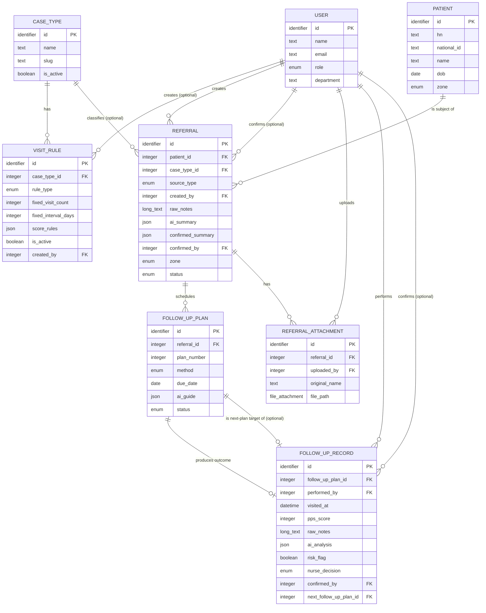

# Database Specification — Chira Continuity Care (Triple C)

| | |
|---|---|
| **ระบบ** | Chira Continuity Care (Triple C) — ระบบ continuity-of-care สำหรับทีมเยี่ยมบ้าน/ติดตามผู้ป่วยของโรงพยาบาล |
| **เวอร์ชันเอกสาร** | 1.0 |
| **วันที่เขียน** | 2026-08-28 |
| **สถานะโค้ด ณ วันที่เขียน** | โครง domain-specific ของ Laravel (migrations/models/controllers/services) — **ยังไม่ scaffold เป็นแอปที่รันได้** (ไม่มี `composer.json`/`artisan`/`vendor/`) ดู [SETUP.md](../../SETUP.md) |
| **ขอบเขตเอกสารนี้** | 8 entity ที่มีอยู่จริงในโค้ดวันนี้: `User`, `Patient`, `CaseType`, `VisitRule`, `Referral`, `FollowUpPlan`, `FollowUpRecord`, `ReferralAttachment` — ไม่รวม entity ที่ยังไม่ implement |
| **เอกสารที่เกี่ยวข้อง** | [CLAUDE.md](../../CLAUDE.md), [docs/api/API_SPEC.md](../api/API_SPEC.md) (เมื่อสร้างแล้ว), [docs/testing/TEST_PLAN.md](../testing/TEST_PLAN.md) |

## 1. Purpose and Conventions

This document describes the domain data model of Triple C conceptually — what each entity represents and
how entities relate — independent of the underlying database engine. Type categories used throughout:
`identifier`, `text`, `long_text`, `integer`, `decimal`, `boolean`, `date`, `datetime`, `enum` (allowed
values listed explicitly), `reference` (foreign key with named target entity and cardinality),
`structured/json`, `file/attachment`.

Every entity below is grounded in the current migrations and models under `database/migrations/` and
`app/Models/`; business rules are cross-referenced against `CLAUDE.md` and the relevant service classes
(`ZoneResolver`, `VisitPlanService`, `AiService`) where the migration/model alone doesn't state the rule.

### 1.1 The one rule that governs every AI-touching entity

Human-in-the-loop confirmation is non-negotiable across this whole schema. Wherever an entity has both an
`ai_*` field and a corresponding confirmed/decision field (`Referral.ai_summary` → `Referral.confirmed_summary`;
`FollowUpRecord.ai_analysis` → `FollowUpRecord.nurse_decision`/`risk_flag`), the `ai_*` field is written only
by `AiService` and is always a draft; the confirmed/decision field is written only by an explicit nurse
action and is the only field scheduling/status logic is allowed to read. `FollowUpPlan.ai_guide` is the one
exception that has no separate "confirmed" counterpart — it's advisory reading material for the visiting
staff member, not a decision-bearing field, so it does not feed `VisitPlanService` or any status transition.

## 2. Entity-Relationship Diagram

## 3. Entities

### 3.1 User

**Purpose.** A hospital staff account — ward/OPD staff who intake cases, home-visit team members who
perform and record follow-ups, and admins who configure case types/visit rules and manage other accounts.

| Attribute | Business meaning | Type | Required | Constraints / rules | Notes |
|---|---|---|---|---|---|
| `id` | Unique identifier | identifier | Y | Primary key | |
| `name` | Staff member's display name | text | Y | | |
| `email` | Login identifier | text | Y | Unique | Standard authentication attribute (Breeze scaffolding) |
| `password` | Login credential | text | Y | Stored hashed, never exposed in output | |
| `role` | Access-control role | enum (`ward_staff`, `home_visit_team`, `admin`) | Y | Default `ward_staff` for new signups | Drives the `role` middleware / RBAC across the app |
| `department` | Staff member's ward/department | text | N | | Free text, informational |
| `email_verified_at` | When the email was confirmed | datetime | N | | Standard authentication attribute |
| `created_at` / `updated_at` | Record bookkeeping | datetime | Y | System-managed | |

**Primary key.** `id`.

**Relationships.**
- User (1) — VisitRule (N): a user may be the `created_by` of many visit rules. Optional; if the creating
  user is later removed, the reference is cleared (the rule itself is preserved), per the domain rule "keep
  the visit rule, forget who authored it" implemented by a nullifying-on-delete behavior.
- User (1) — Referral (N) as creator: a user (`created_by`) intakes many referrals. Required — a referral
  always has a known intake author.
- User (1) — Referral (N) as confirmer: a user (`confirmed_by`) may confirm many referrals' care plans.
  Optional until confirmation happens; cleared (not cascaded) if that user account is removed.
- User (1) — ReferralAttachment (N): a user uploads many attachments (`uploaded_by`). Required.
- User (1) — FollowUpRecord (N) as performer: a user (`performed_by`) performs many follow-up visits/calls.
  Required.
- User (1) — FollowUpRecord (N) as confirmer: a user (`confirmed_by`) confirms many follow-up decisions.
  Optional until confirmation; cleared if the account is removed.

**Business rules / invariants.**
- Role is one of exactly three values (`ROLE_WARD_STAFF`, `ROLE_HOME_VISIT_TEAM`, `ROLE_ADMIN` constants on
  the model); only `admin` may reach `/admin/*` administration routes (case type/visit rule/user management).
- New signups default to `ward_staff`; there is no self-service path to `admin` or `home_visit_team`.

---

### 3.2 Patient

**Purpose.** The demographic and geographic record of a person receiving continuity-of-care follow-up,
identified primarily by the hospital's own patient number (HN).

| Attribute | Business meaning | Type | Required | Constraints / rules | Notes |
|---|---|---|---|---|---|
| `id` | Unique identifier | identifier | Y | Primary key | |
| `hn` | Hospital number — the hospital's own patient identifier | text | Y | Unique | Used as the natural key for find-or-create when a referral is submitted |
| `national_id` | Thai national ID number | text | N | | |
| `name` | Patient's full name | text | Y | | |
| `dob` | Date of birth | date | N | | Used to compute approximate age fed into AI summary prompts |
| `phone` | Contact phone number | text | N | | |
| `address` | Street/house address | long_text | N | | |
| `sub_district` | ตำบล/แขวง | text | N | | Primary input to automatic zone resolution (see below) |
| `district` | อำเภอ/เขต | text | N | | |
| `province` | Province | text | N | | |
| `zone` | Catchment zone this patient falls into | enum (`in_area`, `out_area`) | Y | Default `in_area` | Drives whether follow-ups default to home visits or phone calls |
| `created_at` / `updated_at` | Record bookkeeping | datetime | Y | System-managed | |

**Primary key.** `id`.

**Relationships.**
- Patient (1) — Referral (N): a patient may have many referrals (cases) opened over time, e.g. one per
  admission/episode. Referrals are removed together with their patient (cascading), since a referral cannot
  meaningfully exist without its patient.

**Business rules / invariants.**
- A patient record is found-or-created by `hn` at referral-intake time — submitting a referral for an HN
  that already exists updates that patient's demographic fields rather than creating a duplicate patient.
- `zone` is normally derived automatically: `ZoneResolver` compares the submitted `sub_district` (trimmed,
  case-insensitive) against the `in_area_sub_districts` list in `config/catchment.php`. If `sub_district` is
  blank, or the configured catchment list is empty (not yet set up for the deploying hospital), resolution
  returns "undetermined" and the system falls back to whatever zone value the intake staff member selected
  manually (a `zone_override` flag on intake explicitly requests the manual value over the auto-detected
  one).
- `zone` also seeds the `Referral.zone` value at intake time and indirectly determines each `FollowUpPlan`'s
  default `method` (in-area → `home_visit`, out-of-area → `phone_call`).

---

### 3.3 CaseType

**Purpose.** A configurable classification of case (e.g. post-partum, palliative care) that determines
which visit-scheduling rule applies to referrals of that type. Managed by admins.

| Attribute | Business meaning | Type | Required | Constraints / rules | Notes |
|---|---|---|---|---|---|
| `id` | Unique identifier | identifier | Y | Primary key | |
| `name` | Display name of the case type | text | Y | | e.g. "หลังคลอด", "Palliative Care" |
| `slug` | Machine-readable identifier | text | Y | Unique | Referenced by AI prompts as the set of selectable case types, and by the AI's own suggested classification (`suggested_case_type_slug`) |
| `description` | Free-text explanation of when to use this case type | long_text | N | | |
| `is_active` | Whether this case type is currently offered for new referrals | boolean | Y | Default `true` | Only active case types appear in intake dropdowns and AI prompt option lists |
| `created_at` / `updated_at` | Record bookkeeping | datetime | Y | System-managed | |

**Primary key.** `id`.

**Relationships.**
- CaseType (1) — VisitRule (N): a case type may have multiple visit-rule records over time (e.g. superseded
  configurations), but only the most recent active one governs scheduling (see `VisitRule` §3.4). If the
  case type is deleted, its visit rules are deleted with it (cascading) — a visit rule cannot outlive the
  case type it governs.
- CaseType (1) — Referral (N): a case type classifies many referrals. Optional on the referral side (a
  referral can exist without a case type assigned yet, e.g. before the nurse confirms the AI's suggested
  classification during care-plan confirmation); if the case type is later removed, referrals referencing it
  keep existing but have the reference cleared rather than being deleted.

**Business rules / invariants.**
- `activeVisitRule()` resolves to the most recently created visit rule for this case type where
  `is_active = true`; this is the single rule `VisitPlanService` consults, so having zero active rules for a
  case type means new referrals of that type get no auto-generated follow-up plans until an admin configures
  one.

---

### 3.4 VisitRule

**Purpose.** The scheduling policy for a case type — how many follow-up visits/calls to generate and how
far apart, either as a fixed count or as a score-driven interval table. Configured by admins.

| Attribute | Business meaning | Type | Required | Constraints / rules | Notes |
|---|---|---|---|---|---|
| `id` | Unique identifier | identifier | Y | Primary key | |
| `case_type_id` | The case type this rule governs | reference → CaseType (N:1) | Y | On case type deletion, this rule is deleted too | |
| `rule_type` | Which scheduling strategy this rule uses | enum (`fixed_count`, `score_based`) | Y | | `fixed_count` = a fixed number of visits at a fixed interval (e.g. 3 post-partum visits); `score_based` = interval looked up from a score-range table (e.g. PPS Score for palliative care) |
| `fixed_visit_count` | Total number of visits/calls to pre-generate | integer | N (required when `rule_type = fixed_count`) | | Defaults to 1 in scheduling logic if left unset despite being a fixed_count rule |
| `fixed_interval_days` | Days between consecutive visits | integer | N (required when `rule_type = fixed_count`) | | Defaults to 7 in scheduling logic if left unset |
| `score_rules` | Score-range → interval lookup table | structured/json | N (required when `rule_type = score_based`) | Array of `{min, max, interval_days, label}` ranges | e.g. `[{"min":10,"max":30,"interval_days":7,"label":"ทุกสัปดาห์"}]`; looked up by the PPS Score recorded on the most recent `FollowUpRecord` |
| `is_active` | Whether this is the currently effective rule for its case type | boolean | Y | Default `true` | Only the active rule is used by `VisitPlanService`; multiple historical (inactive) rules may exist per case type |
| `created_by` | Admin who authored this rule | reference → User (N:1) | N | Reference cleared (not the rule deleted) if that user is removed | |
| `created_at` / `updated_at` | Record bookkeeping | datetime | Y | System-managed | |

**Primary key.** `id`.

**Relationships.**
- VisitRule (N) — CaseType (1): see §3.3.
- VisitRule (N) — User (1) as creator: see §3.1.

**Business rules / invariants.**
- `rule_type` is the single switch that determines how `VisitPlanService.generateInitialPlans()` behaves:
  - `fixed_count` — every planned visit (1..`fixed_visit_count`) is created up front, spaced
    `fixed_interval_days` apart from referral confirmation time, because the schedule doesn't depend on any
    outcome data that doesn't exist yet.
  - `score_based` — only plan #1 is created at confirmation time. Its due date uses
    `intervalDaysForScore(initial_pps_score)` if an initial PPS Score was supplied at care-plan confirmation,
    falling back to a 14-day default otherwise; subsequent plans cannot be pre-generated because their
    interval depends on a PPS Score that is only known after a visit is actually performed and recorded.
- For a `score_based` rule, if the PPS Score supplied doesn't fall in any configured range in `score_rules`,
  scheduling logic falls back to a 14-day default interval rather than failing.
- A case type is expected to have at most one currently-effective (`is_active = true`) visit rule at a time
  (enforced by convention/admin workflow, not a database uniqueness constraint) — `activeVisitRule()` picks
  the most recently created active row if more than one exists.

---

### 3.5 Referral

**Purpose.** The central "case" entity — a single episode of continuity-of-care tracking for one patient,
from intake through AI-assisted summarization, nurse-confirmed care planning, scheduled follow-ups, and
eventual closure.

| Attribute | Business meaning | Type | Required | Constraints / rules | Notes |
|---|---|---|---|---|---|
| `id` | Unique identifier | identifier | Y | Primary key | |
| `patient_id` | The patient this referral concerns | reference → Patient (N:1) | Y | Deleted along with its patient | |
| `case_type_id` | The classified case type, once known | reference → CaseType (N:1) | N | Reference cleared if the case type is removed | Typically set (or confirmed) during care-plan confirmation, not necessarily at intake |
| `source_type` | Where the referral originated | enum (`ward`, `opd`, `internal_dept`, `external_hospital`) | Y | | |
| `source_detail` | Free-text detail of the originating ward/department/hospital | text | N | | |
| `created_by` | Staff member who intake this referral | reference → User (N:1) | Y | | |
| `raw_notes` | The free-text situation/symptom summary typed in at intake | long_text | Y | | Sole input to the AI summarization prompt |
| `ai_summary` | AI-drafted structured summary (patient type, main problem, follow-up need, risk signals, suggested case type) | structured/json | N | Written only by `AiService.summarizeReferral()` | **Draft only** — never read by scheduling/status logic; may carry a `parse_error`/`raw_response` fallback shape if the AI response wasn't valid JSON |
| `ai_summary_generated_at` | When the AI draft summary was produced | datetime | N | | |
| `confirmed_summary` | The nurse-reviewed/edited/confirmed version of the summary | structured/json | N | Written only through the care-plan confirmation action | This is the field all downstream logic (AI guide/analysis prompts) reads — never `ai_summary` directly, once confirmation has happened |
| `confirmed_by` | Nurse who confirmed the care plan | reference → User (N:1) | N | Reference cleared if that user is removed | |
| `confirmed_at` | When the care plan was confirmed | datetime | N | Presence of this value is the operational definition of "confirmed" | |
| `zone` | Catchment zone for this specific referral | enum (`in_area`, `out_area`) | Y | Set at intake from the resolved/overridden patient zone (see §3.2) | Used by `VisitPlanService` to pick each generated plan's default `method` |
| `status` | Lifecycle state of the case | enum (`pending_review`, `plan_confirmed`, `in_progress`, `closed`) | Y | Default `pending_review` | See state-transition rules below |
| `closed_at` | When the case was closed | datetime | N | Set only when `status` transitions to `closed` | |
| `created_at` / `updated_at` | Record bookkeeping | datetime | Y | System-managed | |

**Primary key.** `id`.

**Relationships.**
- Referral (N) — Patient (1): see §3.2.
- Referral (N) — CaseType (1): see §3.3.
- Referral (N) — User (1) as creator, and (N) — User (1) as confirmer: see §3.1.
- Referral (1) — FollowUpPlan (N): a referral's scheduled visits/calls. Deleted along with the referral
  (cascading) — a follow-up plan cannot outlive its referral.
- Referral (1) — ReferralAttachment (N): supporting files uploaded at intake or afterward. Deleted along
  with the referral (cascading).

**Business rules / invariants.**
- `confirmed_summary` may only be set by the nurse care-plan-confirmation action
  (`ReferralController::confirmCarePlan`); it is never written directly from `ai_summary` or any other AI
  output. This is the concrete instance of the project's human-in-the-loop rule for this entity.
- Status transitions observed in the current controllers:
  - `pending_review` → `plan_confirmed`: happens when a nurse confirms the care plan (sets
    `confirmed_summary`/`confirmed_by`/`confirmed_at` and, via `VisitPlanService`, generates the initial
    follow-up plan(s)).
  - `plan_confirmed`/`in_progress` → `in_progress`: set whenever a nurse confirms a follow-up decision of
    "repeat" or "refer" and the referral isn't already `in_progress`.
  - any open status → `closed`: set when a nurse confirms a follow-up decision of "close"; `closed_at` is
    stamped at the same time, and all still-`scheduled` follow-up plans are cancelled
    (`VisitPlanService::cancelRemainingPlans`).
  - There is no modeled transition back out of `closed` in the current code (no "reopen" operation exists).
- `zone` on the referral is a point-in-time copy of the patient's zone at intake time (auto-resolved or
  manually overridden per §3.2) — it does not automatically re-sync if the patient's own `zone` is edited
  later via a different referral.
- A referral can have `case_type_id` null at intake and only receive one at care-plan confirmation time; the
  AI summarization prompt suggests a `suggested_case_type_slug` from active case types, but only the nurse's
  explicit selection at confirmation writes `case_type_id`.

---

### 3.6 FollowUpPlan

**Purpose.** A single scheduled follow-up touchpoint (a home visit or phone call) belonging to a referral,
numbered in sequence.

| Attribute | Business meaning | Type | Required | Constraints / rules | Notes |
|---|---|---|---|---|---|
| `id` | Unique identifier | identifier | Y | Primary key | |
| `referral_id` | The referral this plan belongs to | reference → Referral (N:1) | Y | Deleted along with its referral | |
| `plan_number` | Sequence number of this visit/call within the referral | integer | Y | e.g. 1, 2, 3 | Used to order history and to determine which record is "previous" when building AI prompts |
| `method` | How this follow-up will be conducted | enum (`home_visit`, `phone_call`) | Y | Defaults from the referral's `zone` at generation time (`in_area` → `home_visit`, `out_area` → `phone_call`) | Carried forward unchanged when `VisitPlanService.generateNextPlan()` creates the next plan |
| `due_date` | Date this visit/call is due | date | Y | Computed from the governing visit rule's interval | |
| `ai_guide` | AI-suggested topics/questions to assess before this visit/call | structured/json | N | Written only by `AiService.suggestFollowUpGuide()` | Advisory only — read by staff during the visit, never consumed by scheduling/status logic; has no separate "confirmed" counterpart (see §1.1) |
| `status` | Lifecycle state of this plan | enum (`scheduled`, `done`, `overdue`, `cancelled`) | Y | Default `scheduled` | See rules below |
| `created_at` / `updated_at` | Record bookkeeping | datetime | Y | System-managed | |

**Primary key.** `id`.

**Relationships.**
- FollowUpPlan (N) — Referral (1): see §3.5.
- FollowUpPlan (1) — FollowUpRecord (0..1): a plan produces at most one recorded outcome. A second attempt
  to record an outcome for a plan that already has one is rejected by the controller.
- FollowUpPlan (0..1) — FollowUpRecord (N) as "next plan": a plan may also be the *target* referenced by
  some other record's `next_follow_up_plan_id` (the record whose "repeat"/"refer" decision caused this plan
  to be generated).

**Business rules / invariants.**
- `status = overdue` is a derived/informational condition (`isOverdue()`: `status = scheduled` and
  `due_date` has passed) — the current code does not show a background job that flips stored `status` to
  `overdue`; whether that's computed on read or intended to be a scheduled job is not settled in the code
  (see Open Questions).
- `status = cancelled` is set only in bulk, by `VisitPlanService.cancelRemainingPlans()`, when a referral is
  closed — it cancels every plan still `scheduled` at that point.
- For `fixed_count` visit rules, all plans for a referral are created at once at care-plan confirmation time;
  `generateNextPlan()` therefore no-ops for these referrals because an upcoming `scheduled` plan already
  exists. For `score_based` rules, only plan #1 pre-exists, so `generateNextPlan()` is what actually creates
  plan #2, #3, etc., once a nurse decision of "repeat" or "refer" is confirmed.

---

### 3.7 FollowUpRecord

**Purpose.** The recorded outcome of one follow-up plan's visit/call — what staff observed, the AI's risk
analysis of that observation, and the nurse's mandatory confirmed decision on what happens next.

| Attribute | Business meaning | Type | Required | Constraints / rules | Notes |
|---|---|---|---|---|---|
| `id` | Unique identifier | identifier | Y | Primary key | |
| `follow_up_plan_id` | The plan this is the outcome of | reference → FollowUpPlan (1:1 in practice) | Y | Deleted along with its plan | One record per plan, enforced by controller-level check, not a uniqueness constraint |
| `performed_by` | Staff member who conducted the visit/call | reference → User (N:1) | Y | | |
| `visited_at` | Date/time the visit/call actually took place | datetime | Y | Defaults to "now" if not supplied at recording time | |
| `pps_score` | Palliative Performance Scale score assessed during this visit/call | integer | N | | Feeds `score_based` visit-rule interval lookups for the next plan |
| `raw_notes` | Free-text observations/issues typed in by staff | long_text | Y | | Sole clinical input to the AI risk-analysis prompt |
| `ai_analysis` | AI-drafted risk analysis (risk detected, risk summary, recommendation, suggested decision) | structured/json | N | Written only by `AiService.analyzeFollowUpRecord()` | **Draft only** — may carry a `parse_error`/`raw_response` fallback shape; never written into `risk_flag`/`nurse_decision` automatically |
| `ai_analysis_generated_at` | When the AI draft analysis was produced | datetime | N | | |
| `risk_flag` | Confirmed determination that a real risk signal was found | boolean | Y | Default `false`; set only via the nurse decision-confirmation action | The nurse may agree or disagree with `ai_analysis.risk_detected` — this field, not the AI's, is authoritative |
| `nurse_decision` | The nurse's mandatory decision on what happens next | enum (`repeat`, `refer`, `close`) | N until confirmed | Set only via the decision-confirmation action | This is the field that drives `Referral.status` and next-plan generation — never derived directly from `ai_analysis.suggested_decision` |
| `decision_notes` | Free-text detail of the decision (e.g. who/which department a referral-out goes to) | long_text | N | | |
| `confirmed_by` | Nurse who confirmed this decision | reference → User (N:1) | N | Reference cleared if that user is removed | |
| `confirmed_at` | When the decision was confirmed | datetime | N | Presence of this value is the operational definition of "confirmed" | |
| `next_follow_up_plan_id` | The follow-up plan generated as a consequence of a "repeat"/"refer" decision | reference → FollowUpPlan (N:1) | N | Reference cleared if that plan is later removed | Null for "close" decisions, and null for "repeat"/"refer" decisions where an upcoming plan already existed (fixed_count case) |
| `created_at` / `updated_at` | Record bookkeeping | datetime | Y | System-managed | |

**Primary key.** `id`.

**Relationships.**
- FollowUpRecord (N) — FollowUpPlan (1) via `follow_up_plan_id`: the plan this outcome belongs to.
- FollowUpRecord (N) — User (1) as performer, and (N) — User (1) as confirmer: see §3.1.
- FollowUpRecord (N) — FollowUpPlan (1) via `next_follow_up_plan_id`: the follow-on plan this decision
  produced, if any.

**Business rules / invariants.**
- Creating a record and marking its plan `done` happen together (recording an outcome always transitions the
  parent `FollowUpPlan.status` to `done` in the same transaction).
- `risk_flag` and `nurse_decision` are decision-bearing fields and may only be set by the explicit decision-
  confirmation action, never directly from `ai_analysis` — this is the concrete instance of the project's
  human-in-the-loop rule for this entity ("พยาบาลยืนยันการตัดสินใจเสมอ 100%").
- Confirming a decision of `close` cancels all remaining `scheduled` plans on the parent referral and closes
  the referral; confirming `repeat` or `refer` calls `VisitPlanService.generateNextPlan()`, which is a no-op
  if an upcoming `scheduled` plan already exists (the `fixed_count` case), and otherwise creates the next
  plan using either the `score_based` interval lookup (keyed on this record's `pps_score`) or the
  `fixed_count` rule's interval, defaulting to 14 days if neither applies.
- A given `FollowUpPlan` can have at most one `FollowUpRecord` in practice — enforced at the controller level
  by rejecting a second `storeRecord` call for a plan that already has one, not by a database-level
  uniqueness constraint on `follow_up_plan_id`.

---

### 3.8 ReferralAttachment

**Purpose.** A supporting file (e.g. a referral letter, lab result scan) uploaded against a referral.
Stored on a private disk only — never publicly accessible — and downloaded only through an access-checked
controller action.

| Attribute | Business meaning | Type | Required | Constraints / rules | Notes |
|---|---|---|---|---|---|
| `id` | Unique identifier | identifier | Y | Primary key | |
| `referral_id` | The referral this file is attached to | reference → Referral (N:1) | Y | Deleted along with its referral | |
| `uploaded_by` | Staff member who uploaded the file | reference → User (N:1) | Y | | |
| `original_name` | The file's original filename as uploaded | text | Y | | Used as the download filename |
| `file_path` | Storage location of the file on the private disk | file/attachment | Y | Never resolvable to a public URL | Files live on a `local` (private) disk, not `public` |
| `mime_type` | The file's MIME type | text | N | | |
| `size` | File size in bytes | integer | N | | |
| `created_at` / `updated_at` | Record bookkeeping | datetime | Y | System-managed | |

**Primary key.** `id`.

**Relationships.**
- ReferralAttachment (N) — Referral (1): see §3.5.
- ReferralAttachment (N) — User (1) as uploader: see §3.1.

**Business rules / invariants.**
- Attachments are never served from a public disk/URL — every download goes through a controller action that
  first checks the attachment actually belongs to the referral it's being requested under
  (`abort_unless($attachment->referral_id === $referral->id, 404)`), preventing cross-referral access to
  another case's files by guessing an attachment ID.
- There is no independent "delete attachment" operation in the current code; attachments are only removed as
  a consequence of their parent referral being deleted.

## 4. Open Questions / Assumptions

- **`FollowUpPlan.status = 'overdue'`**: the model exposes a derived `isOverdue()` check, but no scheduled
  job/command in the current code actually writes `overdue` into the stored `status` column. It's unclear
  whether this value is intended to be set by a future artisan command (e.g. a nightly scheduler) or whether
  `overdue` is meant to be computed at read time everywhere and never persisted. Documented as-is; flagged
  for product/engineering decision.
- **`VisitRule` "one active rule per case type" is a workflow convention, not a database constraint**: the
  schema does not enforce uniqueness of `is_active = true` rows per `case_type_id`; `activeVisitRule()`
  simply picks the most recent one if the admin UI ever allows more than one to be active simultaneously.
  Noted here rather than assumed away, since a stricter constraint would be a schema change, not just a
  documentation clarification.
- **`FollowUpRecord` one-record-per-plan is enforced only at the controller layer**, not by a database
  uniqueness constraint on `follow_up_plan_id`. Documented as observed in code; a concurrent double-submit
  is a theoretical gap the human reviewer may want to close with an actual constraint.
- No prior version of this document existed in the repository, so there is nothing to reconcile against —
  this is a first-write from source code and `CLAUDE.md` only.

## 5. Revision History

| Date | Change | Author |
|---|---|---|
| 2026-08-28 | Initial version — documented all 8 in-scope entities (User, Patient, CaseType, VisitRule, Referral, FollowUpPlan, FollowUpRecord, ReferralAttachment), ER diagram, and open questions, grounded in current migrations/models/services. | Claude Code (agent-api-database-schema) |
