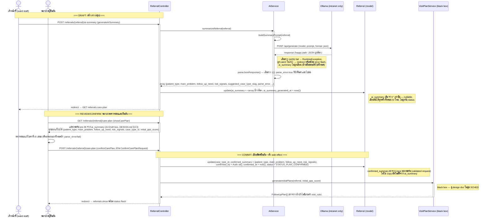
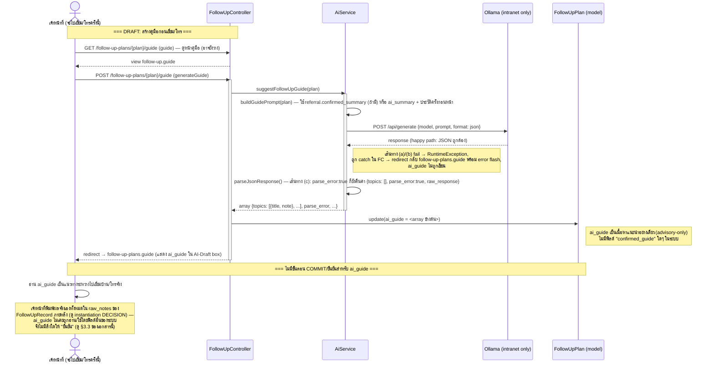
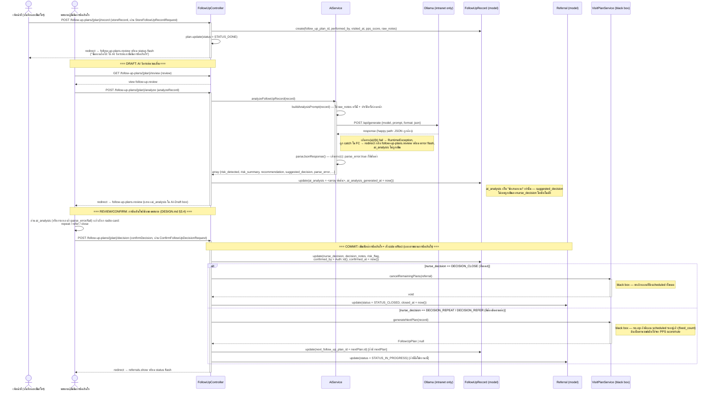

# AI Draft → Nurse Confirm Pattern — Detailed Design

| | |
|---|---|
| **ระบบ** | Chira Continuity Care (Triple C) — ระบบ continuity-of-care สำหรับทีมเยี่ยมบ้าน/ติดตามผู้ป่วยของโรงพยาบาล |
| **เวอร์ชันเอกสาร** | 1.0 |
| **สถานะ** | สอดคล้องกับโค้ดปัจจุบัน (documents existing shipped behavior) — โครง domain-specific ของ Laravel ยังไม่ scaffold เป็นแอปที่รันได้ ดู [SETUP.md](../../SETUP.md) |
| **เอกสารที่เกี่ยวข้อง** | [CLAUDE.md](../../CLAUDE.md) (§"The one rule that governs every AI-touching feature"), [DESIGN.md](../../DESIGN.md) (§3.3 AI-Draft Pattern, §3.4 Nurse-Decision Pattern, §4.1 Human-in-the-loop), [docs/testing/TEST_PLAN.md](../testing/TEST_PLAN.md), [docs/testing/ACCEPTANCE_CRITERIA.md](../testing/ACCEPTANCE_CRITERIA.md) (โมดูล SUMMARY / RECORD / DECISION) |

---

## 1. วัตถุประสงค์ (Objective)

ระบบ Triple C มีกฎความปลอดภัยผู้ป่วยข้อเดียวที่สำคัญที่สุด — **human-in-the-loop**: ทุกครั้งที่
`AiService` ประมวลผล (สรุปข้อมูล, เตรียมคู่มือติดตาม, วิเคราะห์ความเสี่ยง) ผลลัพธ์ที่ได้เป็นเพียง **ร่าง**
เท่านั้น ไม่มีทางที่ผลจาก AI จะไหลเข้าฟิลด์ที่ขับเคลื่อนสถานะ/กำหนดการ (`Referral.status`,
`FollowUpRecord.nurse_decision`, การสร้าง `FollowUpPlan` ใหม่) โดยไม่ผ่านการตรวจสอบและยืนยันของพยาบาลก่อน

กฎนี้ถูกนำไปใช้ซ้ำ **3 ครั้ง** ในจุดที่ไม่เหมือนกันทุกประการของ workflow — เอกสารนี้เขียนขึ้นเพื่อ:

1. อธิบาย pattern เชิงแนวคิด (conceptual) ที่ใช้ร่วมกันทั้ง 3 จุด ในที่เดียว แทนที่จะแยกเป็น 3 เอกสาร
   (เป็นทางเลือกที่ตั้งใจเลือก — ดู §7 Key Design Decisions)
2. บันทึกรายละเอียด sequence-level ของแต่ละ instantiation (SUMMARY, RECORD-guide, DECISION) พร้อม
   sequence diagram ของตัวเอง เพื่อให้ตรวจสอบ/ทดสอบ/ต่อยอดได้โดยไม่ต้องอ่านโค้ดใหม่ทุกครั้ง
3. ชี้ให้เห็นความไม่สมมาตรที่ตั้งใจ (RECORD-guide ไม่มีขั้นตอน "ยืนยัน" แยก) ว่าเป็นคุณสมบัติที่ออกแบบไว้
   ไม่ใช่ความไม่สอดคล้องที่ต้อง "แก้"

เอกสารนี้บันทึก **พฤติกรรมที่มีอยู่แล้วในโค้ด** (ไม่ใช่ฟีเจอร์ใหม่) — ขอบเขตจึงเน้นความถูกต้องตรงกับ
`app/Services/AiService.php`, `app/Http/Controllers/ReferralController.php`,
`app/Http/Controllers/FollowUpController.php`, `app/Services/VisitPlanService.php` ณ เวลาที่เขียน

## 2. ขอบเขต (Scope)

### อยู่ในขอบเขต

- Pattern เชิงแนวคิดของ "AI สร้างร่าง → พยาบาลตรวจสอบ/ยืนยัน → ผลกระทบต่อระบบ (side effect)" และ actor/
  component ที่เกี่ยวข้อง
- 3 instantiation ที่มีอยู่จริงในโค้ด:
  1. **SUMMARY** — `generateAiSummary()` → `showCarePlan()` → `confirmCarePlan()`
  2. **RECORD-guide** — `generateGuide()` (ไม่มีขั้นตอนยืนยันแยก)
  3. **DECISION** — `analyzeRecord()` → `confirmDecision()`
- กลไกร่วมของการเรียก Ollama (`callOllama()`/`parseJsonResponse()`) และ 3 เส้นทาง fail/degraded ที่เกิดขึ้น
  ได้ในทุก instantiation
- ข้อจำกัดเรื่อง role/route middleware ที่พบจริงในโค้ดสำหรับ action เหล่านี้

### นอกขอบเขต (explicitly out of scope)

- ตรรกะภายในของ `VisitPlanService` (`generateInitialPlans`/`generateNextPlan`/`cancelRemainingPlans`) —
  ถูกอ้างถึงเป็น black box ในเอกสารนี้เท่านั้น รายละเอียด `fixed_count` vs `score_based` เป็นของ
  design doc โมดูล SCHED ของตัวเอง (ยังไม่มีไฟล์ — ถ้าต้องการควรเขียนแยก)
- คุณภาพ/ความถูกต้องเชิงเนื้อหาของคำตอบ AI (โมเดล Ollama วินิจฉัยถูกไหม) — ไม่อยู่ในขอบเขตของการออกแบบ
  ระบบ (ดู `docs/testing/TEST_PLAN.md` §2.2 ที่ระบุไว้เช่นกัน)
- รายละเอียด UI/CSS เจาะจงของแต่ละหน้า (`referrals.care-plan` เป็นต้น) — อ้างอิง DESIGN.md §3.3/§3.4
  เป็น pattern ที่ใช้ ไม่อธิบาย layout ทีละ pixel
- การ scaffold ตัวแอป Laravel เอง (composer/artisan/npm) — เป็น precondition ไม่ใช่สิ่งที่ออกแบบในเอกสารนี้
- Performance/โหลดของ Ollama เอง (เช่น concurrent request หลายเคสพร้อมกัน) — ไม่พบโค้ดที่จัดการ queue/
  throttling ในปัจจุบัน จึงไม่มีอะไรให้อธิบาย (ดู §10 Risks)

## 3. Conceptual Design

### 3.1 Actors / Components

| Actor / Component | บทบาท |
|---|---|
| **เจ้าหน้าที่ผู้ริเริ่ม flow** (ward staff / home-visit team member — ตาม route ที่ใช้) | กดปุ่ม "ขอ AI สรุป/เตรียมคู่มือ/วิเคราะห์" เพื่อสร้างร่าง — **ไม่จำเป็นต้องเป็นคนเดียวกับผู้ยืนยัน** |
| **พยาบาลผู้ตรวจสอบ/ยืนยัน (confirming nurse)** | อ่าน/แก้ไขร่างที่ AI สร้าง แล้วกดยืนยันในฟอร์มแยก — เป็นคนเดียวที่เขียนฟิลด์ตัดสินใจได้ |
| [`AiService`](../../app/Services/AiService.php) | จุดเดียวที่คุยกับ LLM — 3 เมธอด: `summarizeReferral()`, `suggestFollowUpGuide()`, `analyzeFollowUpRecord()` แต่ละเมธอดสร้าง Thai prompt แบบ strict-JSON แล้ว parse ผ่าน `parseJsonResponse()` |
| **Ollama** (self-hosted LLM, ภายนอกระบบ Laravel) | รับ prompt คืนคำตอบผ่าน `config('ai.ollama')` → ต้องเป็น intranet URL เท่านั้น (ดู [config/ai.php](../../config/ai.php)) — ห้ามชี้ไปยัง endpoint สาธารณะ/cloud เด็ดขาด เพราะ prompt มี PHI ผู้ป่วยฝังอยู่ |
| [`ReferralController`](../../app/Http/Controllers/ReferralController.php) | คุมทั้ง draft action (`generateAiSummary`) และ confirm action (`confirmCarePlan`) ของ instantiation SUMMARY — คนละเมธอด คนละ route |
| [`FollowUpController`](../../app/Http/Controllers/FollowUpController.php) | คุม draft-only action ของ RECORD-guide (`generateGuide`) และ draft+confirm ของ DECISION (`analyzeRecord`/`confirmDecision`) |
| [`VisitPlanService`](../../app/Services/VisitPlanService.php) | **Black box ในเอกสารนี้** — ถูกเรียกเฉพาะจาก confirm action เท่านั้น (`confirmCarePlan`→`generateInitialPlans`, `confirmDecision`→`generateNextPlan`/`cancelRemainingPlans`) ไม่เคยถูกเรียกจาก draft action |
| [`Referral`](../../app/Models/Referral.php) / [`FollowUpPlan`](../../app/Models/FollowUpPlan.php) / [`FollowUpRecord`](../../app/Models/FollowUpRecord.php) | โมเดลที่ถือทั้งฟิลด์ร่าง (`ai_*`) และฟิลด์ยืนยัน (`confirmed_*`, `nurse_decision`) |

**เรื่อง role restriction ที่ตรวจสอบจากโค้ดจริง:** ใน [routes/web.php](../../routes/web.php) ทุก route ของ
`referrals.*` และ `follow-up-plans.*` (รวมทั้ง draft action และ confirm action ทั้ง 3 instantiation) อยู่ใต้
`Route::middleware('auth')` เท่านั้น — **ไม่มี middleware `role:...`** จำกัดว่าใครสร้างร่างได้/ใครยืนยันได้
ผู้ใช้ที่ authenticate แล้วไม่ว่าจะเป็น `ward_staff`, `home_visit_team`, หรือ `admin` เข้าถึง action เหล่านี้ได้
เท่ากันหมด (สอดคล้องกับที่ `docs/testing/ACCEPTANCE_CRITERIA.md` บันทึกไว้ในหัวข้อ ADMINRBAC ว่า "Non-admin
routes remain equally accessible to all roles" — เป็นข้อเท็จจริงที่บันทึกไว้ ไม่ใช่ gap ที่ค้นพบใหม่ในเอกสารนี้)
ดังนั้นการแยก "ผู้ริเริ่ม" กับ "ผู้ยืนยัน" ในเอกสารนี้เป็นการแยกเชิง **workflow/UX** (คนละหน้า คนละปุ่ม คนละฟอร์ม)
ไม่ใช่การแยกเชิง **RBAC** — ในทางปฏิบัติคนคนเดียวกันมักจะกดทั้งสองปุ่มติดกันได้เลยถ้าอยู่หน้าเดียวกันตอนนั้น
แต่สถาปัตยกรรมของโค้ด (สอง action คนละเมธอด คนละ route คนละ HTTP request) บังคับให้ต้อง "ผ่าน" ขั้นตอนยืนยัน
เป็นการกระทำที่แยกจากขั้นตอนสร้างร่างเสมอ ไม่ว่าใครจะเป็นคนกด

### 3.2 Pattern ทั่วไป

```
[draft action]                              [confirm action]
ผู้ใช้กดปุ่ม "ขอ AI ..."                      ผู้ใช้ (มักเป็นพยาบาล) ตรวจสอบ/แก้ไข แล้วกดยืนยัน
   │                                              │
   ▼                                              ▼
AiService::xxx()  ──(POST /ai-summary etc.)──▶  เขียนฟิลด์ ai_* (draft, nullable,   เขียนฟิลด์ confirmed_*/
เขียนฟิลด์ ai_* + ai_*_generated_at              เขียนทับได้ทุกครั้งที่รันใหม่)      nurse_decision (เขียนได้
(draft, nullable)                                                                    จาก confirm action เท่านั้น)
   │                                                                                        │
   │                                                                                        ▼
   │                                                                          [ถ้ามี] เรียก VisitPlanService
   │                                                                          (side effect ด้าน scheduling —
   │                                                                          เกิดขึ้นจาก confirm action
   │                                                                          เท่านั้น ไม่เคยเกิดจาก draft action)
   ▼
ไม่มี side effect ด้าน scheduling/status ใดๆ
```

หลักการที่ยึดในทุก instantiation:

1. **ฟิลด์ร่าง (`ai_summary`, `ai_guide`, `ai_analysis`) เขียนได้จาก draft action เท่านั้น** และเขียนทับได้
   ทุกครั้งที่เจ้าหน้าที่กด "ขอ AI ใหม่" — ไม่มีการสะสมประวัติ (เขียนทับ ไม่ append)
2. **ฟิลด์ที่ขับเคลื่อนการตัดสินใจ (`confirmed_summary`, `nurse_decision`, `case_type_id` หลังยืนยัน,
   `Referral.status`) เขียนได้จาก confirm action เท่านั้น** — คนละ controller method, คนละ route, คนละ
   HTTP request จาก draft action เสมอ
3. **Side effect ด้านกำหนดการ/สถานะเคส (`VisitPlanService::generateInitialPlans/generateNextPlan/
   cancelRemainingPlans`, การเปลี่ยน `Referral.status`) ถูกเรียกจาก confirm action เท่านั้น** —
   draft action ไม่เคยแตะ `VisitPlanService` หรือ `Referral.status`
4. **ฟอร์มยืนยันต้อง pre-fill จากร่างแต่แก้ไขได้เสมอ** (DESIGN.md §3.3: "ทุกช่องข้อมูลต้องแก้ไขได้") —
   ค่าที่บันทึกจริงมาจาก input ของฟอร์ม ณ เวลา submit ไม่ใช่ค่าที่ AI เสนอโดยตรง (แม้พยาบาลจะไม่แก้อะไรเลย
   ค่าก็ยัง "ผ่าน" การพิมพ์/ส่งฟอร์มของมนุษย์ ไม่ใช่การ copy อัตโนมัติจากฟิลด์ ai_* ไปยัง confirmed_* โดยระบบ)

### 3.3 ความไม่สมมาตรที่ตั้งใจ: SUMMARY/DECISION มีขั้นตอนยืนยันแยก แต่ RECORD-guide ไม่มี

ทั้ง 3 instantiation ปฏิบัติตามกฎเดียวกัน ("AI ไม่เคยขับเคลื่อนฟิลด์ตัดสินใจเพียงลำพัง") แต่ **น้ำหนักของ
กลไกป้องกัน** ต่างกันตามลักษณะของสิ่งที่ AI สร้าง:

| Instantiation | ฟิลด์ร่าง | มีขั้นตอน "ยืนยัน" แยกไหม | เหตุผล |
|---|---|---|---|
| SUMMARY | `Referral.ai_summary` | **มี** — `confirmCarePlan()` เขียน `confirmed_summary` แยกฟิลด์ | ผลลัพธ์ขับเคลื่อน `case_type_id` (จึงขับเคลื่อน `VisitRule` ที่ใช้คำนวณกำหนดการทั้งเคส) และ `Referral.status` — เป็นฟิลด์ตัดสินใจระดับสูงสุดของเคส ต้องมี audit trail (`confirmed_by`/`confirmed_at`) ชัดเจน |
| DECISION | `FollowUpRecord.ai_analysis` | **มี** — `confirmDecision()` เขียน `nurse_decision`/`decision_notes`/`risk_flag` แยกฟิลด์ | ผลลัพธ์ขับเคลื่อนว่าจะสร้างแผนถัดไปหรือปิดเคส (side effect ที่ย้อนกลับยาก) จึงต้องมีการยืนยันบังคับพร้อม audit trail เช่นเดียวกับ SUMMARY |
| **RECORD-guide** | `FollowUpPlan.ai_guide` | **ไม่มี** — `ai_guide` ไม่เคยถูก "เลื่อนขั้น" (promote) ไปเป็นฟิลด์ยืนยันแยกใดๆ | เนื้อหาเป็นเพียงหัวข้อ/คำถามแนะนำให้เจ้าหน้าที่อ้างอิง **ระหว่าง** การเยี่ยม/โทร ไม่เคยถูกอ่านหรือใช้โดยฟิลด์อื่นใดของระบบ ไม่ขับเคลื่อนกำหนดการ ไม่ขับเคลื่อนสถานะ ไม่มีอะไรให้ "ยืนยัน" เพราะไม่มีการตัดสินใจเกิดขึ้นจากมัน — เจ้าหน้าที่อ่านแล้วไปทำงานจริง (เก็บบันทึกผลใน `FollowUpRecord.raw_notes` ซึ่งเป็นข้อความที่เจ้าหน้าที่พิมพ์เองทั้งหมด ไม่ใช่ copy จาก `ai_guide`) |

นี่คือ**กรณีที่เบากว่า (lighter-weight case) ของหลักการเดียวกัน** ไม่ใช่ความไม่สอดคล้องที่ต้องแก้ — หลักการ
"AI ไม่เคยขับเคลื่อนฟิลด์ตัดสินใจเพียงลำพัง" ยังคงเป็นจริงสำหรับ `ai_guide` เพราะไม่มีฟิลด์ตัดสินใจใดๆ ให้มัน
ขับเคลื่อนตั้งแต่แรก การบังคับให้มีปุ่ม "ยืนยันคู่มือ" จะเป็นภาระ UX โดยไม่มีความเสี่ยงด้านความปลอดภัยผู้ป่วย
ที่ต้องป้องกันเพิ่ม (ดู DESIGN.md §4.4 Field-first — ฟอร์มควรกระชับ ไม่บังคับกรอกเกินจำเป็นโดยเฉพาะหน้าที่ใช้
ภาคสนาม)

## 4. Sequence Flow

ทุก diagram ด้านล่างแสดงการเรียก AI ด้วย 3 กิจกรรม (activation) แยกกันเสมอ: **draft** (AiService สร้างร่าง) →
**review/confirm** (มนุษย์ตรวจสอบ/แก้ไข) → **commit** (เขียนฟิลด์ตัดสินใจ + side effect) ไม่เคยยุบรวมเป็น
ลูกศรเดียว "AI ตัดสินใจ"

### 4.1 กลไกร่วม: การเรียก Ollama และ 3 เส้นทาง fail/degraded

ทั้ง 3 instantiation เรียกผ่าน `AiService::callOllama()` แบบเดียวกัน (POST `{OLLAMA_URL}/api/generate` พร้อม
`format: json`) แล้ว parse ผ่าน `parseJsonResponse()` — มีเส้นทางที่เป็นไปได้ 3 แบบ:

| เส้นทาง | จุดเกิด | ผลลัพธ์ |
|---|---|---|
| **(a) Connection exception** | `Http::post()` throw (`\Throwable`) เช่น connect timeout, DNS ผิด | `AiService` catch → log error → throw `RuntimeException` ข้อความไทย ("ไม่สามารถเชื่อมต่อกับเซิร์ฟเวอร์ AI ได้ กรุณาลองใหม่ หรือกรอกข้อมูลด้วยตนเอง") — controller catch `\Throwable` แล้ว redirect กลับพร้อม flash `error` — **ฟิลด์ร่างไม่ถูกเขียนเลย** |
| **(b) HTTP response `->failed()`** | Ollama ตอบ status ≥ 400 | เหมือน (a) ทุกประการ — log + `RuntimeException` ข้อความไทย ("เรียกใช้ AI ไม่สำเร็จ กรุณาลองใหม่ หรือกรอกข้อมูลด้วยตนเอง") — **ฟิลด์ร่างไม่ถูกเขียนเลย** |
| **(c) Response 200 แต่ body ไม่ใช่ JSON ที่ถูกต้อง** | `json_decode()` ล้มเหลว หรือผลลัพธ์ไม่ใช่ array | `parseJsonResponse()` log warning แล้ว **คืนค่า** `array_merge($defaults, ['parse_error' => true, 'raw_response' => $raw])` — **ฟิลด์ร่างถูกเขียนจริง** (พร้อม `parse_error: true` และค่า default ว่างในทุก key) ไม่ throw — controller เขียนต่อไปตามปกติ |

จุด (a)/(b) เป็น **fatal path** — ไม่มีอะไรถูกเขียน ผู้ใช้เห็น error flash แล้วต้องกดลองใหม่ หรือกรอกฟอร์ม
ยืนยันด้วยตนเองทั้งหมด (ฟอร์ม confirm ไม่ผูกกับการมีอยู่ของฟิลด์ ai_* — กรอกเองได้เสมอ)

จุด (c) เป็น **degraded-but-non-fatal path** — ฟิลด์ร่างถูกเขียนแต่มีค่าว่าง/ไม่สมบูรณ์พร้อมธง
`parse_error: true`; หน้าที่แสดงร่าง (AI-Draft box ตาม DESIGN.md §3.3) ต้องตรวจสอบธงนี้และแจ้งผู้ใช้ว่า AI
ตอบมาไม่ตรงรูปแบบ แทนที่จะแสดงค่าว่างโดยไม่มีคำอธิบาย — ฟอร์มยืนยันยังใช้งานได้ปกติเพราะทุกช่องแก้ไขได้อยู่แล้ว

ในแต่ละ diagram ด้านล่าง แสดง happy path เต็ม และย่อ 3 เส้นทางนี้ไว้เป็นหมายเหตุ/note เดียว (ไม่ผูก
alt-block เต็มรูปแบบซ้ำ 3 ครั้งต่อ diagram) เพื่อไม่ให้ diagram สับสน

### 4.2 Instantiation 1 — SUMMARY (`generateAiSummary` → `showCarePlan` → `confirmCarePlan`)



### 4.3 Instantiation 2 — RECORD-guide (`generateGuide`, ไม่มีขั้นตอนยืนยันแยก)



### 4.4 Instantiation 3 — DECISION (`storeRecord` → `review` → `analyzeRecord` → `confirmDecision`)



## 5. Data Model Impact

**ไม่มีการเปลี่ยนแปลง schema** — เอกสารนี้บันทึกพฤติกรรมที่มีอยู่แล้วในโค้ดปัจจุบัน (migrations/models ที่มี
คอลัมน์เหล่านี้อยู่แล้ว):

| ตาราง | คอลัมน์ร่าง (AI-only) | คอลัมน์ยืนยัน (nurse-only) |
|---|---|---|
| `referrals` | `ai_summary` (json, nullable), `ai_summary_generated_at` | `confirmed_summary` (json), `confirmed_by`, `confirmed_at`, `case_type_id`, `status` |
| `follow_up_plans` | `ai_guide` (json, nullable) | *(ไม่มี — ดู §3.3)* |
| `follow_up_records` | `ai_analysis` (json, nullable), `ai_analysis_generated_at` | `nurse_decision`, `decision_notes`, `risk_flag`, `confirmed_by`, `confirmed_at`, `next_follow_up_plan_id` |

## 6. Key Design Decisions & Alternatives Considered

| # | การตัดสินใจ | ทางเลือกที่พิจารณา | เหตุผลที่เลือก |
|---|---|---|---|
| 1 | เขียนเป็น **เอกสารรวมเดียว** ครอบคลุมทั้ง 3 instantiation แทนที่จะแยก 3 ไฟล์ (SUMMARY_DESIGN.md, RECORD_GUIDE_DESIGN.md, DECISION_DESIGN.md) | (ก) แยก 3 ไฟล์ตามโมดูล test plan (ข) รวมเป็นไฟล์เดียวตาม pattern (ค) รวมเป็น 1 ไฟล์แต่แยก section ตาม controller แทน pattern | ผู้ใช้เลือกไฟล์รวมโดยตรง (ตามที่ระบุใน brief) — เหตุผลเชิงออกแบบ: pattern (draft→confirm→commit) เป็นแนวคิดเดียวที่ใช้ซ้ำ 3 ที่ การอ่านทั้ง 3 instantiation เทียบกันในเอกสารเดียวช่วยให้เห็นความไม่สมมาตร (§3.3) ชัดกว่าการแยกไฟล์ที่ต้องเปิดสลับไปมา |
| 2 | `VisitPlanService` ถูกปฏิบัติเป็น **black box** ในทุก sequence diagram | (ก) อธิบายละเอียด fixed_count/score_based ในเอกสารนี้ด้วย (ข) black box + อ้างอิงไปยัง design doc แยกของ SCHED (ค) ไม่พูดถึงเลย | ตรงกับ brief: จุดสนใจของเอกสารนี้คือ human-in-the-loop boundary (draft/confirm) ไม่ใช่ตรรกะการคำนวณกำหนดการ — การอธิบายละเอียดจะทำให้ diagram รกและซ้ำซ้อนกับสิ่งที่ SCHED design doc (ถ้ามี) ควรเป็นเจ้าของ |
| 3 | RECORD-guide **ไม่มี** ขั้นตอนยืนยันแยก — บันทึกเป็นคุณสมบัติที่ตั้งใจ ไม่ใช่ gap | (ก) เสนอให้เพิ่มปุ่ม "ยืนยันคู่มือ" เพื่อความสมมาตรกับอีก 2 instantiation (ข) คงพฤติกรรมเดิม เพราะไม่มีฟิลด์ตัดสินใจให้ยืนยัน (ค) ลบ `ai_guide` ออกจาก field ที่ persist เลย (เก็บเป็น cache ชั่วคราวแทน) | เลือก (ข) ตามพฤติกรรมโค้ดจริงที่มีอยู่แล้ว — `ai_guide` ไม่เคยขับเคลื่อนฟิลด์ตัดสินใจใดๆ จึงไม่มีความเสี่ยงด้านความปลอดภัยผู้ป่วยที่ต้องมีกลไก confirm เพิ่ม การเพิ่มปุ่มยืนยันจะขัดกับ DESIGN.md §4.4 (Field-first — ไม่บังคับกรอกเกินจำเป็น) โดยไม่ได้อะไรเพิ่ม |
| 4 | เส้นทาง fail/degraded (a)/(b)/(c) ถูกย่อเป็น **note เดียวต่อ diagram** แทนการวาด `alt` block เต็มรูปแบบซ้ำ 3 ครั้ง | (ก) วาด alt-block เต็มทั้ง 3 เส้นทางในทุก diagram (ข) สรุปไว้ใน §4.1 ครั้งเดียว + note สั้นในแต่ละ diagram (ค) ไม่พูดถึงเลยในระดับ diagram | เลือก (ข) — brief อนุญาตให้ "ใช้ note/branch ไม่ต้องสะกดครบทั้ง 3 ทุก diagram ถ้าจะเสียการอ่านง่าย" กลไกเหมือนกันทุก instantiation จึงสมเหตุสมผลที่จะอธิบายรวมครั้งเดียวแล้วอ้างอิงซ้ำ |
| 5 | เอกสารระบุชัดว่า **ไม่มี role middleware** จำกัด draft-action/confirm-action ของทั้ง 3 instantiation | (ก) สมมติว่ามี role restriction ตาม CLAUDE.md (ที่พูดถึง role ทั่วไป) โดยไม่ตรวจสอบ (ข) ตรวจสอบ routes/web.php จริงแล้วรายงานตามที่พบ | เลือก (ข) ตาม brief ที่ขอให้ตรวจสอบ route middleware จริง — พบว่า `referrals.*`/`follow-up-plans.*` ทุก route อยู่ใต้ `auth` เท่านั้น ไม่มี `role:...` ตรงกับที่ `docs/testing/ACCEPTANCE_CRITERIA.md` บันทึกไว้แล้วในโมดูล ADMINRBAC — เป็นการยืนยันข้อเท็จจริงเดิม ไม่ใช่การค้นพบใหม่ |

## 7. Error Handling & Edge Cases

- **(a)/(b) Ollama เชื่อมต่อไม่ได้/request ล้มเหลว:** ฟิลด์ร่าง (`ai_summary`/`ai_guide`/`ai_analysis`) **ไม่
  ถูกเขียน** ผู้ใช้เห็น flash `error` เป็นข้อความไทยที่บอกให้ลองใหม่หรือกรอกเองได้ (ตรงตาม DESIGN.md §4.3:
  ข้อความ error ต้องบอกสาเหตุและวิธีแก้) — ฟอร์มยืนยันของทั้ง SUMMARY และ DECISION ไม่ผูกกับการมีอยู่ของฟิลด์
  ai_* จึงยังกรอกเองและยืนยันได้ตามปกติแม้ AI ล้มเหลวสนิท
- **(c) Ollama ตอบ 200 แต่ไม่ใช่ JSON ถูกต้อง:** ฟิลด์ร่างถูกเขียนพร้อม `parse_error: true` และ
  `raw_response` เก็บข้อความดิบไว้เพื่อ debug — หน้าที่แสดง AI-Draft box **ต้อง**เช็ค `parse_error` และแจ้ง
  ผู้ใช้อย่างชัดเจนแทนที่จะแสดงค่าว่างเฉยๆ (เป็นข้อสังเกต UI ที่ view ต้องจัดการ ไม่ใช่แค่ controller)
- **กดขอ AI ซ้ำหลายครั้งก่อนยืนยัน:** ทั้ง `ai_summary`/`ai_guide`/`ai_analysis` เป็น `update()` แบบเขียนทับ
  ไม่มี versioning/history — ถ้าเจ้าหน้าที่กดขอ AI ใหม่ ค่าก่อนหน้าจะหายไป (ไม่กระทบข้อมูลที่ยืนยันแล้วเพราะ
  คนละฟิลด์ แต่ถ้ายังไม่ยืนยัน การเขียนทับซ้ำๆ ไม่มีร่องรอย)
- **บันทึกผลซ้ำ (`storeRecord`)/ยืนยันซ้ำ:** `createRecord()`/`storeRecord()` ใช้ `abort_if($plan->record()->exists(), 403, ...)` กันการบันทึกซ้ำสำหรับ plan เดียวกัน — แต่ `confirmCarePlan()`/`confirmDecision()` ไม่มี
  guard แบบเดียวกันที่ป้องกันการยืนยันซ้ำสองครั้ง (เช่น สอง tab เปิดพร้อมกันแล้ว submit ฟอร์มยืนยันทั้งคู่) —
  เป็น edge case ที่โค้ดปัจจุบันไม่มี lock/idempotency check ชัดเจน (ดู §8 Risks)
- **DECISION branch `close` vs `repeat/refer`:** ทั้งสองสาขาอยู่ใน DB transaction เดียวกัน (`DB::transaction`
  ใน `confirmDecision()`) — ถ้า `VisitPlanService` throw exception กลางทาง การ update `nurse_decision`
  ที่ทำไปแล้วใน record จะ rollback ด้วย (atomic ทั้งก้อน) จึงไม่มีสถานะครึ่งๆ กลางๆ ระหว่าง record confirmed
  กับ referral status/plan ที่ตามมา
- **`generateNextPlan` คืน `null`:** เมื่อมีแผน `scheduled` รออยู่แล้ว (กรณี fixed_count ที่สร้างไว้ล่วงหน้า)
  `next_follow_up_plan_id` จะไม่ถูกตั้งค่า (ยังคง null) — ฝั่ง UI ต้องรองรับกรณีนี้ (ไม่ error แต่ก็ไม่มีลิงก์
  ไปแผนถัดไปจาก record นี้โดยตรง)

## 8. Risks / Open Questions

*(หมายเหตุ: ไม่มี "Open Decisions" เชิงสถาปัตยกรรมในเอกสารนี้ตามที่ brief ระบุไว้ว่าเป็นการบันทึก
พฤติกรรมที่มีอยู่แล้ว — รายการด้านล่างเป็นความเสี่ยง/ข้อสังเกตที่ไม่ใช่ fork ที่ต้องเลือกทาง ไม่ใช่การเปิด
decision ใหม่)*

- **ไม่มี idempotency guard บนขั้นตอนยืนยัน (`confirmCarePlan`/`confirmDecision`):** ต่างจาก `storeRecord`
  ที่มี `abort_if` กันการบันทึกซ้ำอย่างชัดเจน สอง endpoint ยืนยันนี้ไม่มีกลไกป้องกัน double-submit (เช่น
  double-click, สอง tab) — ในทางปฏิบัติ `update()` ซ้ำจะเขียนทับด้วยค่าล่าสุด (ไม่ corrupt ข้อมูล) แต่
  `VisitPlanService::generateNextPlan()`/`generateInitialPlans()` มี guard กันสร้างซ้ำอยู่แล้วในตัวเอง
  (เช็ค `followUpPlans()->exists()` / เช็คแผน scheduled ที่มีอยู่) จึงลดความเสี่ยงเชิงข้อมูลลงได้บางส่วน
  แต่ `confirmed_by`/`confirmed_at` อาจถูกเขียนทับด้วยผู้ใช้คนที่สอง — ควรพิจารณาเพิ่ม guard ถ้าเกิดปัญหาจริง
  ในทางปฏิบัติ (ไม่ใช่ fork สถาปัตยกรรมที่ต้องตัดสินใจตอนนี้ เป็นเพียงข้อสังเกต)
- **ไม่มี audit log แยกสำหรับการ "ขอ AI ใหม่" (re-generate):** เมื่อกดขอ AI ซ้ำ ค่า `ai_*` เดิมหายไปโดยไม่มี
  ร่องรอยว่าเคยมีร่างอื่นมาก่อน — ถ้าในอนาคตต้องการ traceability สำหรับ QA/ตรวจสอบภายหลัง (เช่น เคยมีร่างที่
  แนะนำต่างจากที่ยืนยันจริง) จะต้องเพิ่มตารางประวัติแยก ปัจจุบันยังไม่มี
- **Ollama ไม่ scaffold จริง — พฤติกรรม timeout ยังไม่เคยทดสอบกับโหลดจริง:** `config('ai.ollama.timeout')`
  ตั้งจาก `OLLAMA_TIMEOUT` env (default 60s) แต่ยังไม่มีการวัด response time จริงของโมเดล `typhoon` บน
  ฮาร์ดแวร์ รพ. จริง — ความเสี่ยงด้าน UX (เจ้าหน้าที่รอนานแค่ไหนก่อนเห็น error) เป็น unknown ที่ขึ้นกับ
  environment ไม่ใช่สิ่งที่ออกแบบแก้ในโค้ดชั้นนี้
- **การพึ่งพา middleware `auth` เพียงอย่างเดียว (ไม่มี role check) สำหรับทั้ง draft และ confirm action:**
  เป็นพฤติกรรมที่ตั้งใจตามที่ระบบออกแบบไว้ (บันทึกในโค้ด/ACCEPTANCE_CRITERIA.md อยู่แล้ว) แต่หมายความว่า
  เอกสารนี้ไม่สามารถระบุ "นางพยาบาล" เป็น role ที่บังคับทาง technical ได้ — เป็นเพียง convention เชิง
  workflow ว่าใครควรเป็นคนกดปุ่มไหน ถ้าในอนาคตต้องการบังคับด้วย role จริง (เช่น เฉพาะ `home_visit_team`/
  `admin` เท่านั้นที่ยืนยันได้) จะเป็นการเปลี่ยนแปลงเชิงสถาปัตยกรรมที่ควรเปิด Open Decision แยกตอนนั้น
