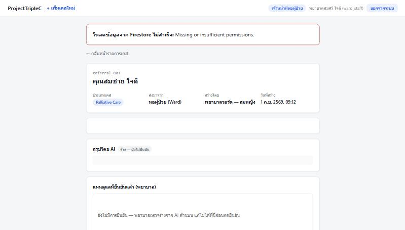

# หลักฐานการรัน Firestore จริง (Evidence)

เอกสารนี้เก็บภาพหน้าจอยืนยันว่าได้สร้าง Firebase project จริงและรัน seed script (`seed.js`) เข้า Firestore
สำเร็จ ตามที่ระบุไว้ใน [README.md](README.md) และ [SCOPE.md](SCOPE.md)

## Firestore Console — collection `referrals`

- **Project:** `triplec-a5e75` (Firebase project จริง, mode: `(default)` Native mode)
- **Path:** Cloud Firestore → Database → Data
- **สิ่งที่เห็นในภาพ:**
  - Collection ทั้งหมดที่ seed เข้าไปจริง: `caseTypes`, `patients`, `referrals`, `users`
  - Collection `referrals` มีครบ 5 documents: `referral_001` ถึง `referral_005`
  - เปิดดู document `referral_001` แสดงฟิลด์ตามที่ออกแบบไว้ใน [ENTITY_CONTEXT.md](ENTITY_CONTEXT.md)
    เช่น `caseTypeId: "ct_palliative"`, `createdBy: "user_ward01"`, `patientId: "patient_001"`,
    `confirmedBy: null`, `confirmedAt: null` — ตรงกับสถานะ `pending_review` (ยังไม่ผ่านการยืนยันของ
    พยาบาล ตามกฎ human-in-the-loop)

## พิสูจน์ว่าหน้าเว็บอ่านข้อมูลจาก Firestore จริง (ไม่ใช่ mock)

หน้า [referral-detail.html](referral-detail.html) ต่อกับ Firestore ผ่าน `getDoc()` ใน
[js/referral-detail.js](js/referral-detail.js) — โหลดเอกสาร `referrals/referral_001` แล้ว join กับ
`patients` / `caseTypes` / `users` ตอนเปิดหน้า (ไม่ใช่ข้อมูลฝังในโค้ดอีกต่อไป) พิสูจน์ด้วยการแก้ข้อมูลจริง
ใน Firebase Console แล้วกด F5 ที่หน้าเว็บ:

**ก่อนแก้ไข:** ฟิลด์ `patients/patient_001.fullName` = `"นายสมชาย เดินทางไกล"` (ค่าที่ seed ไว้ตาม
[seed.js](seed.js)) และหน้าเว็บแสดงชื่อนี้ตรงกัน (ดูภาพหน้าเว็บก่อนแก้ไขในบทสนทนา — โหลดจาก Firestore
สำเร็จ ไม่มี error)

**แก้ไขค่าใน Firebase Console:**

**กด F5 ที่หน้าเว็บ — ข้อความเปลี่ยนตามทันที:**

ยืนยันว่าหน้าเว็บไม่ได้ผูกกับ mock data แต่ query ข้อมูลจริงจาก Firestore ทุกครั้งที่โหลดหน้า

## สัปดาห์ที่ 7 — หลักฐานเพิ่มเติม: CRUD จริง + Auth + ACL

### เพิ่ม/แก้สถานะ/ลบ เขียนกลับ Firestore จริง (ไม่ใช่แค่ mutate ในหน่วยความจำ)

ทดสอบจริงระหว่างพัฒนา (ผ่าน Browser tool):

1. ล็อกอินด้วย `ward1@triplec.demo` → เพิ่มเคสใหม่ผ่าน `referral-create.html` → เอกสารใหม่ปรากฏใน
   Firestore ทันที (ตรวจสอบด้วย `getDoc()` โดยตรง)
2. ล็อกอินด้วย `nurse1@triplec.demo` → เห็นเคสใหม่นั้นในรายการ (เห็นทุกเคส ไม่ใช่แค่ของตัวเอง) → กด
   "ยืนยันแผนดูแล" → สถานะเปลี่ยนเป็น `plan_confirmed` พร้อม `confirmedBy`/`confirmedAt` จริงใน Firestore
3. รีเฟรชหน้า/เปิดใหม่ → ข้อมูลที่ยืนยันแล้วยังอยู่ครบ (โหลดจาก Firestore ไม่ใช่ state ในเบราว์เซอร์)
4. ล็อกอินด้วย `admin1@triplec.demo` → ลบเคสทดสอบ → เอกสารหายไปจาก Firestore จริง (ตรวจด้วย `getDoc()`
   คืนค่า `exists() === false`)

### ทดสอบ ACL / Security Rules จริง (ไม่ใช่แค่ซ่อนปุ่มฝั่ง UI)

รันคำสั่งตรงในคอนโซลเบราว์เซอร์ (เรียก Firestore SDK ตรง ๆ ข้าม UI) เพื่อพิสูจน์ว่า `firestore.rules`
ปฏิเสธจริง ไม่ใช่แค่ UI ซ่อนปุ่ม:

| การทดสอบ | ผลลัพธ์ |
|---|---|
| ไม่ได้ล็อกอิน (`auth.currentUser === null`) พยายาม `getDoc(referrals/referral_001)` | `FirebaseError: permission-denied — "Missing or insufficient permissions."` |
| ล็อกอินเป็น `ward1` (ward_staff) พยายาม `getDoc(referrals/referral_001)` ซึ่ง**ไม่ใช่**เคสที่ตัวเองสร้าง | `permission-denied` เช่นกัน — ยืนยันกฎ "ห้ามดูของคนอื่น" |
| ล็อกอินเป็น `admin1` สร้างเคสใหม่ด้วยตัวเอง แล้วพยายาม `updateDoc()` ยืนยันแผนดูแลเคสนั้นทันที (self-approve) | `permission-denied` — ยืนยันกฎ "ห้ามอนุมัติของตัวเอง" ใช้กับทุก role รวมถึง admin |

### ภาพหน้าจอ: private page ที่ล็อกอินไม่ได้ (ต้องมีใน `docs/`)

ภาพนี้ถ่ายจากเว็บที่ deploy จริง (`https://triplec-a5e75.web.app`) — ล็อกอินด้วย `ward1@triplec.demo`
แล้วเปิดลิงก์ไปยัง `referral-detail.html?id=referral_001` (เคสที่สร้างโดยเจ้าหน้าที่คนอื่นตามข้อมูล seed
เดิม ไม่ใช่ ward1) หน้าเว็บพยายามโหลดข้อมูลแล้วถูก Firestore Security Rules ปฏิเสธจริง ขึ้นข้อความ
"โหลดข้อมูลจาก Firestore ไม่สำเร็จ: Missing or insufficient permissions." ที่ด้านบนหน้า
