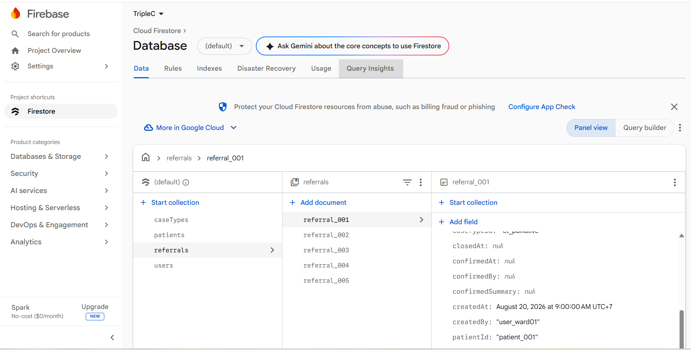

# หลักฐานการรัน Firestore จริง (Evidence)

เอกสารนี้เก็บภาพหน้าจอยืนยันว่าได้สร้าง Firebase project จริงและรัน seed script (`seed.js`) เข้า Firestore
สำเร็จ ตามที่ระบุไว้ใน [README.md](README.md) และ [SCOPE.md](SCOPE.md)

## Firestore Console — collection `referrals`

- **Project:** `triplec-a5e75` (Firebase project จริง, mode: `(default)` Native mode)
- **Path:** Cloud Firestore → Database → Data
- **สิ่งที่เห็นในภาพ:**
  - Collection ทั้งหมดที่ seed เข้าไปจริง: `caseTypes`, `patients`, `referrals`, `users`
  - Collection `referrals` มีครบ 5 documents: `referral_001` ถึง `referral_005`
  - เปิดดู document `referral_001` แสดงฟิลด์ตามที่ออกแบบไว้ใน [ENTITY_CONTEXT.md](ENTITY_CONTEXT.md)
    เช่น `caseTypeId: "ct_palliative"`, `createdBy: "user_ward01"`, `patientId: "patient_001"`,
    `confirmedBy: null`, `confirmedAt: null` — ตรงกับสถานะ `pending_review` (ยังไม่ผ่านการยืนยันของ
    พยาบาล ตามกฎ human-in-the-loop)
