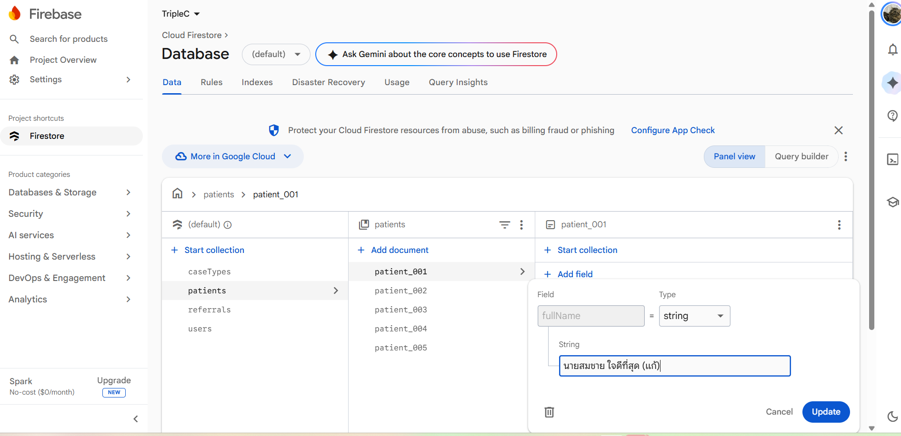
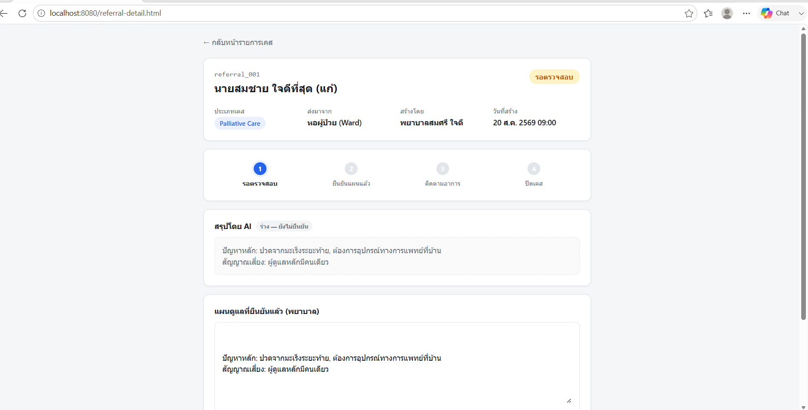

# หลักฐานการรัน Firestore จริง (Evidence)

เอกสารนี้เก็บภาพหน้าจอยืนยันว่าได้สร้าง Firebase project จริงและรัน seed script (`seed.js`) เข้า Firestore
สำเร็จ ตามที่ระบุไว้ใน [README.md](README.md) และ [SCOPE.md](SCOPE.md)

## Firestore Console — collection `referrals`

- **Project:** `triplec-a5e75` (Firebase project จริง, mode: `(default)` Native mode)
- **Path:** Cloud Firestore → Database → Data
- **สิ่งที่เห็นในภาพ:**
  - Collection ทั้งหมดที่ seed เข้าไปจริง: `caseTypes`, `patients`, `referrals`, `users`
  - Collection `referrals` มีครบ 5 documents: `referral_001` ถึง `referral_005`
  - เปิดดู document `referral_001` แสดงฟิลด์ตามที่ออกแบบไว้ใน [ENTITY_CONTEXT.md](ENTITY_CONTEXT.md)
    เช่น `caseTypeId: "ct_palliative"`, `createdBy: "user_ward01"`, `patientId: "patient_001"`,
    `confirmedBy: null`, `confirmedAt: null` — ตรงกับสถานะ `pending_review` (ยังไม่ผ่านการยืนยันของ
    พยาบาล ตามกฎ human-in-the-loop)

## พิสูจน์ว่าหน้าเว็บอ่านข้อมูลจาก Firestore จริง (ไม่ใช่ mock)

หน้า [referral-detail.html](referral-detail.html) ต่อกับ Firestore ผ่าน `getDoc()` ใน
[js/referral-detail.js](js/referral-detail.js) — โหลดเอกสาร `referrals/referral_001` แล้ว join กับ
`patients` / `caseTypes` / `users` ตอนเปิดหน้า (ไม่ใช่ข้อมูลฝังในโค้ดอีกต่อไป) พิสูจน์ด้วยการแก้ข้อมูลจริง
ใน Firebase Console แล้วกด F5 ที่หน้าเว็บ:

**ก่อนแก้ไข:** ฟิลด์ `patients/patient_001.fullName` = `"นายสมชาย เดินทางไกล"` (ค่าที่ seed ไว้ตาม
[seed.js](seed.js)) และหน้าเว็บแสดงชื่อนี้ตรงกัน (ดูภาพหน้าเว็บก่อนแก้ไขในบทสนทนา — โหลดจาก Firestore
สำเร็จ ไม่มี error)

**แก้ไขค่าใน Firebase Console:**

**กด F5 ที่หน้าเว็บ — ข้อความเปลี่ยนตามทันที:**

ยืนยันว่าหน้าเว็บไม่ได้ผูกกับ mock data แต่ query ข้อมูลจริงจาก Firestore ทุกครั้งที่โหลดหน้า
